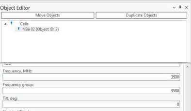
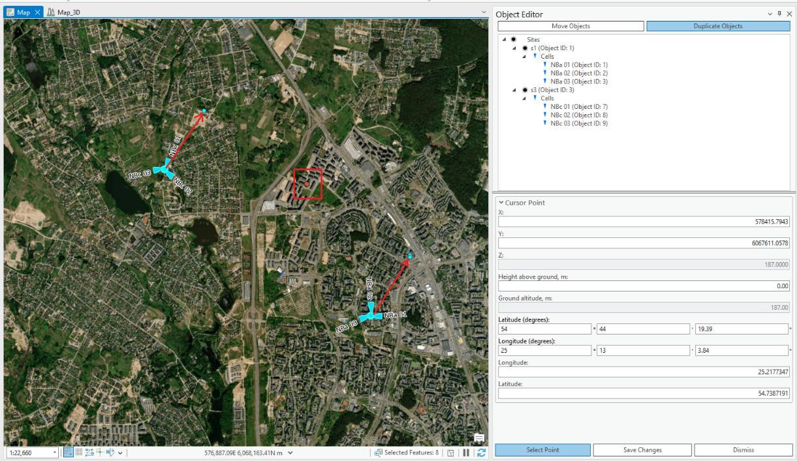

# Object Editor

> **Applies to:** SAT, Sound, EMF, Indoor, RCP. For RLP, see [RLP Object Editor](5-4-rlp-object-editor.md).

The Object Editor lets you change a network object after it has been created and placed on the map.

Choose the Object Editor button to open the Object Editor dialog. Select objects by navigating to the ArcGIS Pro **Edit > Selection** section and choosing the Select tool — the selected objects appear in the Object Editor as a tree hierarchy. To edit one of the selected objects, left-click on it and the corresponding editing menu opens below the list.

## Delete Object

Select and right-click any network object from the selection, then choose **Delete** from the popup.

## Duplicate Object

Select and right-click any object from the selection, then choose **Duplicate** from the popup. The duplicated object retains all information from the original, including coordinates/meridians. To duplicate objects and change their coordinates/meridians at the same time, use the separate **Duplicate Objects** button above the selection tree.

## Move Objects

Choose the Object Editor button to open the dialog. Select the desired objects with the Select tool, then press **Move Objects** in the Object Editor.

There are multiple ways to move objects:

- **If multiple objects are selected**, the Move Objects display shows the geospatial properties of the center point between the objects, denoted as the **Cursor Point**. The Cursor Point is a reference marker shown as a red dot on the map, centrally located among the selected objects. You can adjust its position by entering new coordinates directly, or by clicking **Select Point** and choosing a different location on the map. Moving the Cursor Point shifts all objects to maintain their relative distances from this central point.
- **If a single point object is selected (or several objects at the same location)**, the Move Objects display shows the geospatial properties of that object, also denoted as the **Cursor Point**. The Cursor Point serves as the object's positional anchor — you can move the object by manually updating the Cursor Point's coordinates, or by clicking **Select Point** and choosing a new location on the map. Any movement of the Cursor Point directly translates the object to the new location.

| Button | Description |
|---|---|
| Save Changes | Saves the changes to the objects. |
| Dismiss | Cancels the changes to the objects and closes the dialog. |

## Duplicate Objects

Choose the Object Editor button to open the dialog. Select the object with the Select tool, then press **Duplicate Objects** in the Object Editor dialog.

There are multiple ways to duplicate objects:

- **If multiple objects are selected**, the Duplicate Objects display shows the geospatial properties of the center point between the objects, denoted as the **Cursor Point**. It behaves the same way as in Move Objects: adjust its position by entering coordinates or clicking **Select Point**, and all objects shift to maintain their relative distances from this central point.
- **If a single point object (or several objects at the same location) is selected**, the Duplicate Objects display shows the geospatial properties of that object, denoted as the **Cursor Point** — the object's positional anchor. Moving the Cursor Point directly translates the duplicate to the new location.

| Button | Description |
|---|---|
| Save Changes | Duplicates the objects. |
| Dismiss | Cancels the changes to the objects and closes the dialog. |
