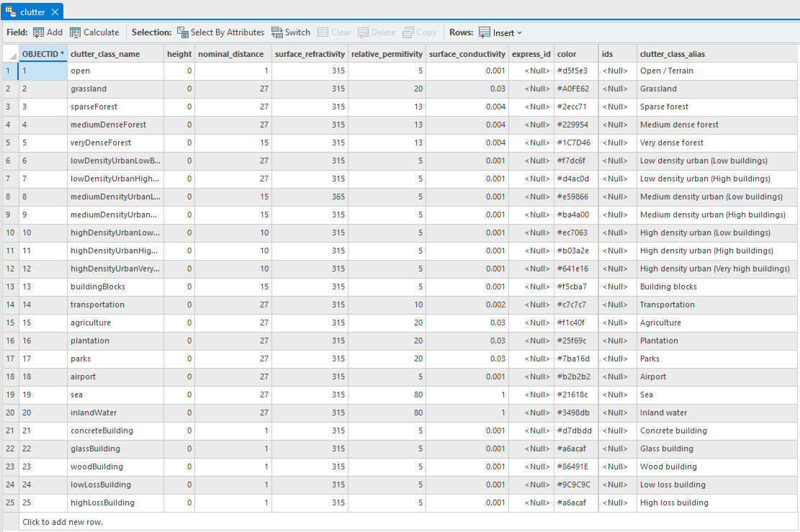
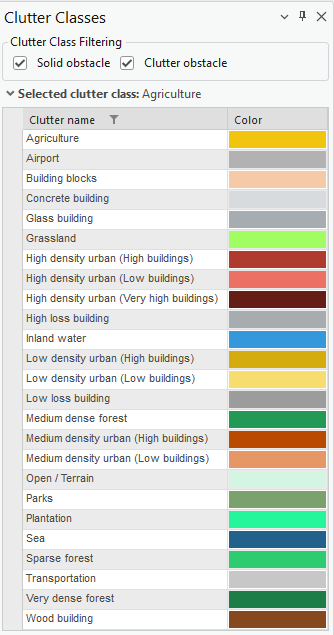
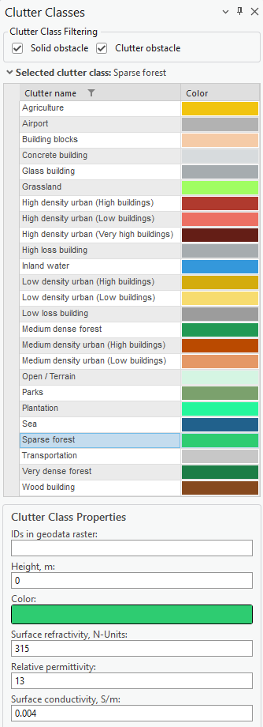

# Clutter Classes

The Clutter Classes tool manages the categories describing different types of environments in telecommunication networks. It relies on the Clutter Classes raster used in the project — the raster values must match the ID values in the Clutter Classes dialog. For example, if "Trees" has a value of `2` in the Clutter Classes raster, this ID must be defined in the Clutter Classes tool.

By default, ESRI's [Sentinel-2 Land Cover](https://livingatlas.arcgis.com/landcoverexplorer/) values are used after workspace creation.

## Clutter Table

The default database includes a table view of the clutter classes, with a row per class and its associated physical properties:

| Field | Description |
|---|---|
| clutter_class_name | Internal clutter class identifier. |
| height | Default clutter height, in meters. |
| nominal_distance | Nominal distance parameter used in propagation calculations. |
| surface_refractivity | Surface refractivity, in N-units. |
| relative_permittivity | Relative permittivity of the surface material. |
| surface_conductivity | Surface conductivity, in S/m. |
| color | Display color for the class (hex value). |
| clutter_class_alias | Human-readable class name shown in the Clutter Classes tool. |

The Sentinel-2 clutter classes raster provides classes such as Open/Terrain, Grassland, Sparse/Medium/Very Dense Forest, Low/Medium/High Density Urban (Low/High/Very High Buildings), Building Blocks, Transportation, Agriculture, Plantation, Parks, Airport, Sea, Inland Water, and Concrete/Glass/Wood/Low Loss/High Loss Building.

## Using the Clutter Classes Dialog

Choose the Clutter Classes button to open the tool. Select one of the clutter classes in the list to open its properties. The class list can be filtered by **Solid obstacle** and/or **Clutter obstacle** categories.

Selecting a class opens its **Clutter Class Properties**, where the new mapping between the land use raster and clutter class data is defined:

| Parameter | Description |
|---|---|
| IDs in geodata raster | The raster ID value(s) mapped to this clutter class. Multiple IDs can be comma-separated. |
| Height, m | Default height used for this clutter class, e.g. for buildings without a Clutter Height raster. |
| Color | Display color for the class. |
| Surface refractivity, N-Units | Surface refractivity value used in propagation calculations. |
| Relative permittivity | Relative permittivity of the surface material. |
| Surface conductivity, S/m | Surface conductivity of the material. |

| Button | Description |
|---|---|
| Apply | Saves changes made to clutter classes. |
| OK | Saves changes made to clutter classes and closes the dialog. |
| Dismiss | Cancels clutter class changes and closes the dialog. |
