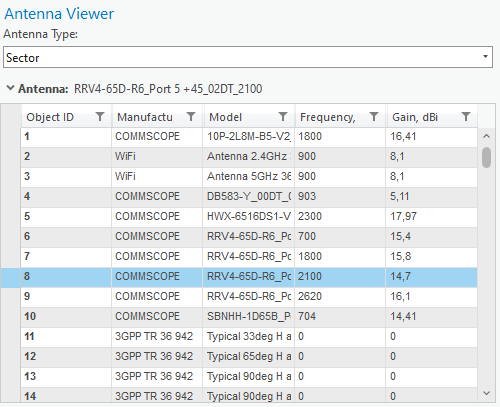
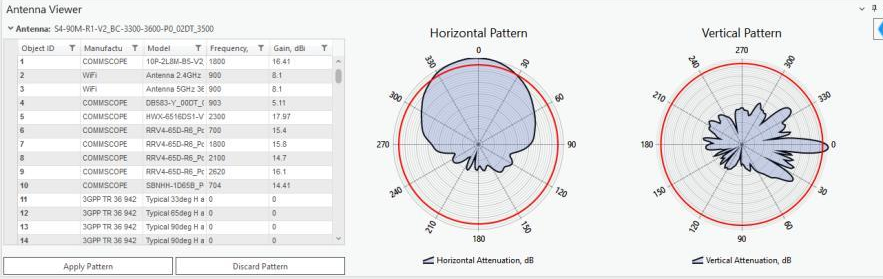
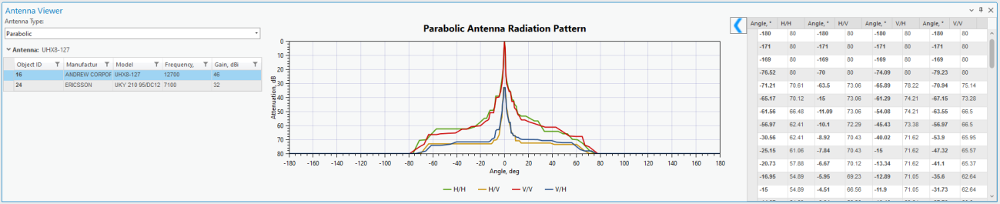

# Antenna Viewer

The Antenna Viewer lets you preview the default antennae, compare their vertical and horizontal patterns, and view the values of these patterns in a table.

Click the Antenna Viewer button to open the tool. You can filter the entries of the antenna table by pressing the filter symbol near one of the field names and entering the desired filter value.

## Preview Antenna Patterns

The antenna **Type** dropdown list contains two antenna types:

- **Sector** — has 2 patterns and pertains to a single network object.
- **Parabolic** — has 4 patterns and pertains to point-to-point network objects (Links in Cellular Expert).

To compare the horizontal and vertical patterns of an antenna, double-click one of the antennas in the antenna list — the patterns, and their corresponding values, appear alongside the list.

> **Applies to:** RLP. RLP mainly uses point-to-point Parabolic antennas — change **Antenna Type** to **Parabolic** to view them. Parabolic antennas are displayed as a single combined attenuation chart (H/H, H/V, V/V, V/H) instead of separate Horizontal/Vertical polar plots.
>
> 
