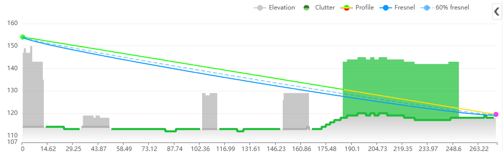
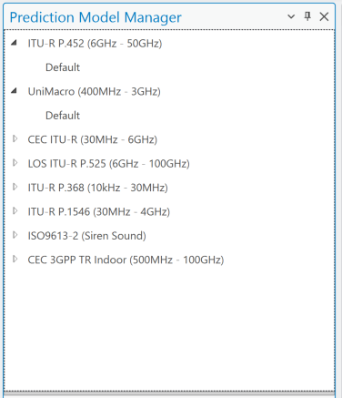
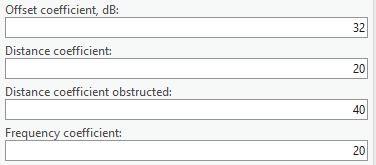
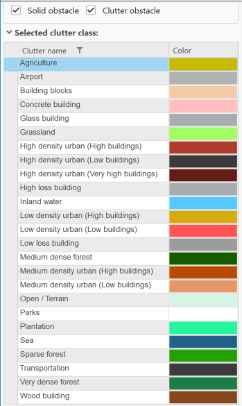
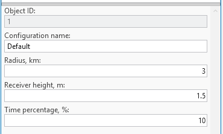
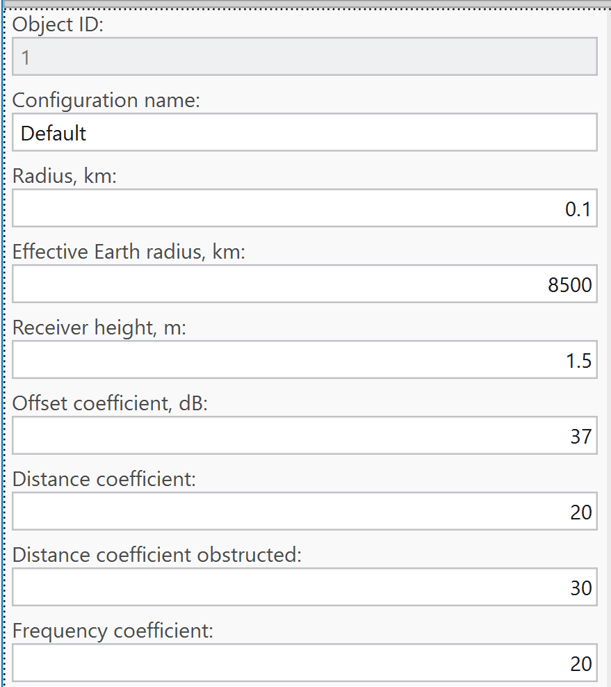

# Prediction Model Manager

CE Path Loss Modelling performs a near-deterministic calculation of received signal levels at each specific point (pixel) in the network's target coverage area, applying a selective path loss model depending on the radio visibility condition between the transmitter antenna and a receiver antenna located at a given point in the coverage area. Radio visibility is evaluated from the DTM, Obstacles, and Clutter path profile information (see [Geographic Data](../3-geographic-data.md)). This evaluation assigns the receiver antenna point to one of three radio visibility conditions:

- **Line-of-Sight (LOS)** — occurs when no terrain irregularities, obstacles, or clutter interpose the direct radio path between the transmitter and receiver antennas. The radio path is understood to include the 1st Fresnel zone around the direct line and accounts for the Spherical Earth effect.
- **Obstructed LOS (OLOS)** — occurs when the direct radio propagation line is interposed by clutter.
- **Non-LOS (NLOS)** — occurs when the direct radio propagation line is interposed by terrain bulges or obstacles.



Depending on the LOS condition at a specific location, the CE tools apply the relevant sub-set of the path loss prediction model, as described below.

> **Note:** When the receiver is located indoors, a special Outdoor-to-Indoor propagation function is applied in addition to the basic path loss.

## Models

Prediction models available in Cellular Expert support frequencies from 10 kHz to 350 GHz. Click the Prediction Model Manager button in the Data Management group to open the dialog.



### CEC ITU-R 3GPP Model (100 MHz – 6 GHz)

A combination model intended for a variety of radiocommunication systems, derived explicitly from ITU-R path loss modelling methods:

a. **LOS condition** — path loss calculated as FSL based on Recommendation ITU-R P.525.
b. **OLOS condition** — total path loss modelled as a combination of basic FSL (ITU-R P.525, with dual slope option) and clutter loss modelling based on Recommendation ITU-R P.2108.
c. **NLOS condition** — path loss as a combination of basic FSL (ITU-R P.525, with dual slope option) and additional diffraction losses based on Recommendation ITU-R P.526.
d. **OLOS+NLOS condition** — path loss as a combination of basic FSL (with dual slope option), diffraction losses (ITU-R P.526), and clutter loss modelling (ITU-R P.2108).
e. **In clutter (building, vegetation, etc.)** — path loss is calculated as above for LOS/OLOS/NLOS, plus an additional penetration loss to simulate an Outdoor-to-Indoor scenario, based on ITU-R P.833 (vegetation clutter) or 3GPP TR 38.901 (buildings).

#### Model application

This deterministic model precisely tracks the main, strongest radio ray, while empirically modeling the scattering of other rays around the receiver. It applies to all ranges of cellular mobile and public safety networks — 2G, 3G, 4G, and 5G — within the 30 MHz to 6 GHz frequency range.

Recommended for accurate wide-area propagation and coverage modeling when precise, up-to-date topographic data is available: DTM, building data (with height information), and vegetation data (with height details) derived from a DSM. Ideally created with LiDAR or similar methods, at a resolution of at least 10 m — 5, 2, or even 1 m or better is preferable for optimal accuracy.

When building data and heights are unavailable, and only DTM and clutter data at 10 m resolution or lower are accessible, use the [UniMacro Model](#unimacro-model-400-mhz-3-ghz) instead, for the narrower 400 MHz to 3 GHz range.

#### Default settings

##### General settings to calculate model loss

| Parameter | Description |
|---|---|
| Offset coefficient (dB) | Offset in decibels added to the path loss grid. Default: `32` dB. |
| Distance coefficient | Slope based on distance between the cell and receiver location. Default: `20`. |
| Distance coefficient obstructed | Slope based on the obstructed distance between the cell and receiver location. Default: `40`. |
| Frequency coefficient | Slope determined by the frequency value. Default: `20`. |



##### Clutter class settings — diffraction, clutter loss, penetration loss, and receiver loss

The Clutter Class option defines predefined clutter categories, each with unique values for diffraction loss, clutter loss, penetration loss, and receiver loss coefficients — describing how a signal is affected when it passes through or terminates in a specific clutter class.



| Parameter | Description |
|---|---|
| Nominal distance, m | Average distance between objects within the clutter class (1–100 m). |
| Diffraction loss coefficient | Multiplier used in diffraction calculations — lower values reduce diffraction loss, higher values increase it. Typically higher for buildings than forests or other clutter types. |
| Enclosed receiver loss offset, dB | Initial entry loss into the clutter class, added to the path loss grid as an offset. |
| Enclosed receiver loss scaling coefficient | Additional signal loss as a function of distance traveled within the clutter class. Higher values increase path loss. |
| Enclosed receiver loss frequency exponent coefficient | Additional loss inside the clutter class based on frequency. Higher values increase path loss, particularly at higher frequencies. |
| Receiver point loss offset, dB | Additional loss offset applied to the path loss grid, representing UE losses. |

##### Clutter Classes default values

| Clutter class | Penetration receiver loss offset | Penetration receiver loss scaling coefficient | Penetration receiver loss frequency exponent coefficient |
|---|---|---|---|
| Open / Terrain | 17 | 0.25 | 1 |
| Grassland | 0 | 0.82 | 0.65 |
| Sparse forest | 0 | 0.82 | 0.65 |
| Medium dense forest | 0 | 0.89 | 0.65 |
| Very dense forest | 0 | 0.95 | 0.65 |
| Low density urban (Low buildings) | 0 | 0.89 | 0.65 |
| Low density urban (High buildings) | 0 | 0.89 | 0.65 |
| Medium density urban (Low buildings) | 0 | 0.89 | 0.65 |
| Medium density urban (High buildings) | 0 | 0.89 | 0.65 |
| High density urban (Low buildings) | 0 | 0.89 | 0.65 |
| High density urban (High buildings) | 0 | 0.89 | 0.65 |
| High density urban (Very high buildings) | 0 | 0.89 | 0.65 |
| Building blocks | 0 | 0.89 | 0.65 |
| Transportation | 0 | 0.89 | 0.65 |
| Agriculture | 0 | 0.89 | 0.65 |
| Plantation | 0 | 0.89 | 0.65 |
| Parks | 0 | 0.89 | 0.65 |
| Airport | 0 | 0.89 | 0.65 |
| Sea | 0 | 0.89 | 0.65 |
| Inland water | 0 | 0.89 | 0.65 |
| Concrete building | 5 | 0.25 | 1 |
| Glass building | 2 | 0.25 | 1 |
| Wood building | 2 | 0.25 | 1 |
| Low loss building | 8.5 | 0.25 | 1 |
| High loss building | 17 | 0.25 | 1 |

### ITU-R P.452 Model (6 GHz – 50 GHz)

Provided as a universally applicable model with a very wide frequency range from 0.1–50 GHz, based on the methodology in Recommendation ITU-R P.452. This model does not define an OLOS visibility condition — clutter is treated as part of the general obstacles category, so only two radio visibility cases are distinguished:

a. **LOS condition** — path loss model based on the FSL principle.
b. **NLOS condition** — total path loss modelled as a combination of basic transmission losses and diffraction losses.

#### Model application

Estimates radio signal propagation over long distances, including terrestrial paths, predicting attenuation from diffraction, tropospheric scatter, ducting, and reflections from the Earth's surface, across 0.1–50 GHz. While the CEC ITU-R 3GPP model above covers 100 MHz–6 GHz, this model is recommended for 6 GHz–50 GHz.

Particularly well-suited for microwave links, and widely used for planning and interference analysis in fixed and mobile radio communication systems.

#### Default settings

##### General settings to calculate model loss

| Parameter | Description |
|---|---|
| Offset coefficient (dB) | Offset in decibels added to the path loss grid. Default: `32` dB. |
| Distance coefficient | Slope based on distance between the cell and receiver location. Default: `20`. |
| Frequency coefficient | Slope determined by the frequency value. Default: `20`. |

##### Multipath and focusing

The correction for multipath and focusing effects accounts for signal enhancements caused by constructive interference and atmospheric focusing. This adjustment reduces total path loss under favorable conditions, such as over-water paths or specific atmospheric gradients. Possible values: Yes or No.

##### Clutter class settings — penetration loss

| Parameter | Description |
|---|---|
| Penetration loss offset, dB | Initial entry loss into the clutter class, added to the path loss grid as an offset. |
| Penetration loss distance coefficient | Additional signal loss as a function of distance traveled within the clutter class. Higher values increase path loss. |
| Penetration loss frequency coefficient | Additional loss inside the clutter class based on frequency. Higher values increase path loss, particularly at higher frequencies. |

##### Clutter Classes default values

| Clutter class | Penetration receiver loss offset | Penetration receiver loss scaling coefficient | Penetration receiver loss frequency exponent coefficient |
|---|---|---|---|
| Open / Terrain | 17 | 0.25 | 1 |
| Grassland | 0 | 0.82 | 0.65 |
| Sparse forest | 0 | 0.82 | 0.65 |
| Medium dense forest | 0 | 0.89 | 0.65 |
| Very dense forest | 0 | 0.95 | 0.65 |
| Low density urban (Low buildings) | 0 | 0.89 | 0.65 |
| Low density urban (High buildings) | 0 | 0.89 | 0.65 |
| Medium density urban (Low buildings) | 0 | 0.89 | 0.65 |
| Medium density urban (High buildings) | 0 | 0.89 | 0.65 |
| High density urban (Low buildings) | 0 | 0.89 | 0.65 |
| High density urban (High buildings) | 0 | 0.89 | 0.65 |
| High density urban (Very high buildings) | 0 | 0.89 | 0.65 |
| Building blocks | 0 | 0.89 | 0.65 |
| Transportation | 0 | 0.89 | 0.65 |
| Agriculture | 0 | 0.89 | 0.65 |
| Plantation | 0 | 0.89 | 0.65 |
| Parks | 0 | 0.89 | 0.65 |
| Airport | 0 | 0.89 | 0.65 |
| Sea | 0 | 0.89 | 0.65 |
| Inland water | 0 | 0.89 | 0.65 |
| Concrete building | 5 | 0.25 | 1 |
| Glass building | 2 | 0.25 | 1 |
| Wood building | 2 | 0.25 | 1 |
| Low loss building | 8.5 | 0.25 | 1 |
| High loss building | 17 | 0.25 | 1 |

### UniMacro Model (400 MHz – 3 GHz)

CE's proprietary combination model, developed and fine-tuned over years of practical experience planning operational cellular mobile networks in the 400–3000 MHz range, to produce coverage predictions closely aligned with what mobile network users actually experience in the field.

a. **LOS condition** — path loss model based on the FSL principle and dual slope based on breakpoint distance.
b. **OLOS or NLOS condition** — path loss modelled using the Extended Hata (Open Area) model with additional diffraction losses based on Recommendation ITU-R P.526.
c. **In clutter (building, vegetation, etc.)** — path loss is calculated as above for LOS/OLOS/NLOS, plus an additional penetration loss to simulate an Outdoor-to-Indoor scenario, based on ITU-R P.833 (vegetation clutter) or 3GPP TR 38.901 (buildings).

#### Model application

Deterministically tracks the main, strongest radio ray in LOS areas, while OLOS and NLOS propagation uses empirically determined parameters from ITU-R and 3GPP recommendations; it also models scattering of other rays around the receiver. Applies empirically validated values for 400 MHz–3 GHz, suitable for all cellular mobile and public safety networks (2G, 3G, 4G, 5G) in that range.

Recommended for wide-area propagation and coverage modeling when building data and heights are unavailable, and only DTM and clutter data at 10 m resolution or lower are accessible. When accurate building geometry/heights are available, and a higher modeling frequency (up to 6 GHz) is needed, use the [CEC ITU-R 3GPP Model](#cec-itu-r-3gpp-model-100-mhz-6-ghz) instead.

#### Default settings

##### Line of Sight coefficients (used to calculate general model loss when Tx and Rx are in LOS condition)

| Parameter | Description |
|---|---|
| Offset coefficient (dB) | Offset in decibels added to the path loss grid. Default: `32` dB. |
| Distance coefficient near | Slope based on distance between the cell and receiver location. Default: `20`. |
| Distance coefficient far | Slope based on breakpoint distance between the cell and receiver location. Default: `40`. |
| Use custom break distance | If Yes, enables a custom Fresnel breakpoint distance value. Path loss dependence on distance is split into near and far zones by the breakpoint distance; this only applies for the LOS condition. |
| Custom break distance, km | Fresnel breakpoint distance beyond which path loss is calculated using the Distance coefficient far parameter. |
| Frequency coefficient | Slope determined by the frequency value. Default: `20`. |

##### Hata 9999 equation (used when Tx and Rx are in OLOS or NLOS condition)

9999 Model is Ericsson's implementation of the Hata Model. Ericsson provides steering parameters of the 9999 Model for different environments, making it convenient to apply as default parameters.

| Parameter | Description |
|---|---|
| Hata Loss: A0 | Constant offset in dB, added to the loss grid — adjust to minimize mean error; regulates the absolute level of the loss curve. Default: `36.2`. |
| Hata Loss: A1 | Distance influence coefficient — represents distance-dependent loss (e.g. atmospheric losses); regulates the slope of the curve. Default: `30.2`. |
| Hata Loss: A2 | Transmitter height influence coefficient — related to DTM errors, real Earth curvature, etc.; regulates the loss curve's vertical position with respect to antenna height. Default: `-12`. |
| Hata Loss: A3 | Okumura-Hata type multiplying factor for log(h_M)·log(d). Default: `0.1`. |

##### Clutter class settings — diffraction, clutter loss, penetration loss, and receiver loss

| Parameter | Description |
|---|---|
| Nominal distance, m | Average distance between objects within the clutter class (1–100 m). |
| Diffraction loss coefficient | Multiplier used in diffraction calculations — higher for buildings than forests or other clutter types. |
| Penetration loss offset, dB | Initial entry loss into the clutter class, added to the path loss grid. |
| Penetration loss distance coefficient | Additional signal loss as a function of distance traveled within the clutter class. |
| Penetration loss frequency coefficient | Additional loss inside the clutter class based on frequency. |
| Receiver point loss offset, dB | Additional loss offset applied to the path loss grid, representing UE losses. |

##### Clutter Classes default values

| Clutter class | Penetration receiver loss offset | Penetration receiver loss scaling coefficient | Penetration receiver loss frequency exponent coefficient |
|---|---|---|---|
| Open / Terrain | 17 | 0.25 | 1 |
| Grassland | 0 | 0.82 | 0.65 |
| Sparse forest | 0 | 0.82 | 0.65 |
| Medium dense forest | 0 | 0.89 | 0.65 |
| Very dense forest | 0 | 0.95 | 0.65 |
| Low density urban (Low buildings) | 0 | 0.89 | 0.65 |
| Low density urban (High buildings) | 0 | 0.89 | 0.65 |
| Medium density urban (Low buildings) | 0 | 0.89 | 0.65 |
| Medium density urban (High buildings) | 0 | 0.89 | 0.65 |
| High density urban (Low buildings) | 0 | 0.89 | 0.65 |
| High density urban (High buildings) | 0 | 0.89 | 0.65 |
| High density urban (Very high buildings) | 0 | 0.89 | 0.65 |
| Building blocks | 0 | 0.89 | 0.65 |
| Transportation | 0 | 0.89 | 0.65 |
| Agriculture | 0 | 0.89 | 0.65 |
| Plantation | 0 | 0.89 | 0.65 |
| Parks | 0 | 0.89 | 0.65 |
| Airport | 0 | 0.89 | 0.65 |
| Sea | 0 | 0.89 | 0.65 |
| Inland water | 0 | 0.89 | 0.65 |
| Concrete building | 5 | 0.25 | 1 |
| Glass building | 2 | 0.25 | 1 |
| Wood building | 2 | 0.25 | 1 |
| Low loss building | 8.5 | 0.25 | 1 |
| High loss building | 17 | 0.25 | 1 |

### LOS ITU-R P.525 Model (6 GHz – 100 GHz)

FSL path loss calculated based on the method in Recommendation ITU-R P.525. Suitable for modelling radio links where LOS is a necessary condition — e.g. Fixed (Point-to-Point) Links or Mobile Systems in mmWave bands.

#### Model application

Typically used for mmWave band frequencies in the 6 GHz–100 GHz range, and provides results only for line-of-sight areas.

#### Default settings

| Parameter | Description |
|---|---|
| Offset coefficient (dB) | Offset in decibels added to the path loss grid. Default: `32` dB. |
| Distance coefficient | Slope based on distance between the cell and receiver location. Default: `20`. |
| Frequency coefficient | Slope determined by the frequency value. Default: `20`. |

### ITU-R P.368 Model (10 kHz – 30 MHz)

Provides a standardized prediction method for assessing the ground-wave field strength of radio waves from 10 kHz to 30 MHz — a band primarily associated with long-range AM and shortwave communication, often for maritime, aeronautical, military, and broadcasting services. Offers guidance for engineers, planners, and researchers working in the MF and HF bands.

#### Model application

Estimates ground-wave propagation field strength and attenuation over the Earth's surface, particularly below 30 MHz. Widely used for planning long-distance communication systems (maritime, broadcasting, low-frequency navigation) where ground-wave propagation is critical. Accounts for terrain conductivity, dielectric properties, and surface roughness.

The model calculates signal strength based on:

- **Frequency (f)** — higher frequencies attenuate more rapidly over ground; the attenuation rate increases significantly above 3 MHz.
- **Distance (d)** — field strength diminishes with increasing distance due to geometrical spreading and absorption by the ground and atmosphere.
- **Surface refractivity, Surface Conductivity (σ), and Relative Permittivity (εᵣ)** — the surface over which the wave propagates critically affects signal strength (sea water: high conductivity, minimal loss; dry land/desert: low conductivity, high loss). Typical conductivity ranges from 10⁻⁴ to 5 S/m; relative permittivity from 4 to 81.

#### Default settings

The general model parameters are radius and receiver height. Additional path loss parameters are derived per clutter class:

| Clutter class | Surface refractivity, N-Units | Relative permittivity | Surface conductivity, S/m |
|---|---|---|---|
| Buildings | 315 | 5 | 0.001 |
| Forest | 315 | 13 | 0.004 |
| Dense forest | 315 | 13 | 0.004 |
| Urban | 315 | 5 | 0.001 |
| Dense urban | 315 | 5 | 0.001 |
| Bare ground | 315 | 10 | 0.002 |
| Crops | 315 | 20 | 0.03 |
| Water | 365 | 80 | 1 |
| Road | 315 | 10 | 0.002 |

### ITU-R P.1546 Model (30 MHz – 4 GHz)

A widely recognized radio propagation prediction method developed by the ITU, primarily used for estimating point-to-area radio signal coverage from 30 MHz to 4000 MHz over terrestrial paths. Especially suitable for broadcasting, land mobile, and fixed services.

#### Key features

- **Versatile application** — supports predictions over land, sea, and mixed paths.
- **Input parameters** — transmitter/receiver heights, terrain profile, clutter (buildings, vegetation), climate, and time/location variability.
- **Time and location variability** — predictions can be tailored for different statistical reliability levels (e.g. 50% or 10% time availability).
- **Clutter and terrain handling** — can incorporate detailed DEMs and clutter data, reflecting buildings, forests, and other surface features.

#### Model application

Designed for wide-area radio propagation prediction based on empirical data and statistical analysis of measured field strengths, providing path loss estimations over land, sea, and mixed terrain for 30 MHz–3 GHz, per ITU-R Recommendation P.1546. Applicable to terrestrial broadcasting, mobile, and public safety networks (2G, 3G, 4G).

Accounts for antenna heights, terrain elevation (DTM), land cover types (clutter), and environmental conditions, with corrections for time variability and location-specific effects. Particularly suitable for modeling LOS and NLOS propagation over long distances where detailed building data is unavailable.

Recommended for national or regional coverage planning, especially where high-resolution DTM (e.g. 30 m) and clutter data (e.g. 10 m resolution) are available but building heights and detailed 3D structures are not. Where accurate building geometry/heights are available and a higher frequency range (up to 6 GHz) is required, use the [CEC ITU-R 3GPP Model](#cec-itu-r-3gpp-model-100-mhz-6-ghz) instead.

#### Default settings

| Parameter | Description |
|---|---|
| Radius | Maximum distance from the transmitter (prediction center) over which the propagation prediction is performed. Limits the spatial extent of the coverage area to optimize calculation time and resource usage. Typically 10–100 km, depending on transmitter power, terrain, and target coverage region. |
| Receiver Height (m) | Height of the receiving antenna above ground level. Impacts predicted signal strength, especially in terrain with elevation changes or obstacles. Guidelines: 1.5–2 m for handheld/mobile users; 10 m or higher for fixed installations (rooftop or vehicular antennas). Accurate receiver height is essential for meaningful signal level predictions. |
| Time Percentage (%) | Percentage of time during which the predicted field strength is expected to be met or exceeded, reflecting statistical variability due to atmospheric and environmental effects. Common values: 50% for general service coverage maps (median conditions); 10% for high-reliability or interference studies. A 10% time prediction means the signal level is met or exceeded during 10% of the time, capturing worst-case propagation conditions. |



### ISO9613 Model (Siren Sound)

> **Note:** This model applies to Siren Sound prediction. See [Add Sirens](5-2-add-object/5-2-5-rcp/5-2-5-3-add-sirens.md).

ISO 9613 is an international standard for predicting outdoor sound propagation, including siren noise-level assessment. It provides a structured method for calculating sound attenuation over distance, considering geometric spreading, atmospheric absorption, ground effects, reflections, and obstacles.

For siren sound prediction, ISO 9613 helps determine the effective coverage area, ensuring warning signals reach the intended audience with sufficient audibility — essential for optimizing siren placement, regulatory compliance, and designing effective emergency alert systems.

#### Model application

Used in siren sound prediction to determine effective coverage, supporting siren placement optimization, regulatory compliance, and emergency alert system design. The primary factors:

1. **Geometric Spreading** — sound intensity decreases as distance from the source increases, following the inverse square law (spherical spreading) or other forms depending on terrain:

   ```
   A_div = 20 * LOG10(d) + 11
   ```

2. **Atmospheric Absorption** — sound is absorbed by the atmosphere as it travels, particularly at higher frequencies; absorption depends on temperature, humidity, and air pressure, and is more significant over longer distances.
3. **Obstacles** — physical barriers (walls, hills, buildings) block or scatter sound waves, reducing sound level in shadow zones behind large or close obstacles.
4. **Directivity of the Source** — accounts for the directionality of the sound source; sirens may focus sound output in certain directions.
5. **Meteorological Conditions** — wind speed, temperature gradients, and humidity affect sound propagation (e.g. sound travels farther downwind, or is absorbed more by humid air).

#### Default settings

| Parameter | Description |
|---|---|
| Distance coefficient | Slope coefficient based on distance, used in Geometric Spreading calculations. Default: `20`. |
| Temperature | Default: `20 °C`. |
| Humidity | Default: `50%`. |
| Meteorological conditions | A factor in decibels depending on local meteorological statistics for wind speed/direction and temperature gradients. In practice, values (C0) range from 0 to approximately +5 dB. Default: `3` dB. |

The **Ground factor** parameter defines the acoustic reflectivity (0 to 1, hard to soft) of the ground surface per clutter class, for more accurate sound-level predictions:

| Clutter class | Ground factor |
|---|---|
| Open / Terrain | 1 |
| Grassland | 1 |
| Sparse forest | 1 |
| Medium dense forest | 1 |
| Very dense forest | 1 |
| Low density urban (Low buildings) | 0.5 |
| Low density urban (High buildings) | 0.3 |
| Medium density urban (Low buildings) | 0.3 |
| Medium density urban (High buildings) | 0.1 |
| High density urban (Low buildings) | 0.1 |
| High density urban (High buildings) | 0 |
| High density urban (Very high buildings) | 0 |
| Building blocks | 0 |
| Transportation | 0 |
| Agriculture | 1 |
| Plantation | 1 |
| Parks | 0.7 |
| Airport | 0 |
| Sea | 0 |
| Inland water | 0 |
| Concrete building | 0 |
| Glass building | 0 |
| Wood building | 0 |
| Low loss building | 0 |
| High loss building | 0 |

### CEC 3GPP TR Indoor Model (500 MHz – 100 GHz)

A high-frequency path loss model for indoor radiocommunication systems from 500 MHz to 100 GHz. Builds on the [CEC ITU-R 3GPP Model](#cec-itu-r-3gpp-model-100-mhz-6-ghz) by adapting it to complex indoor environments — office buildings, residential units, shopping centers, industrial halls. Integrates core ITU-R free-space loss and penetration recommendations with 3GPP-specific methods for indoor multipath, wall attenuation, and frequency-dependent fading.

#### Purpose and use cases

- Indoor wireless access network design (Wi-Fi, 5G NR, mmWave)
- System-level simulations for indoor coverage planning
- Performance evaluation of in-building penetration for outdoor base stations
- Integration with dual-slope and multi-scenario path loss modeling frameworks

#### Model application

A robust, scalable prediction method based on ITU-R principles and 3GPP extensions, engineered for indoor radiowave propagation from clean LOS corridors to deeply obstructed NLOS paths.

#### Key enhancements for indoor use

- Frequency scaling up to 100 GHz supports mmWave and terahertz.
- Wall material database from 3GPP TR 38.901: standard drywall ~2–8 dB per wall; concrete 5–15 dB; glass 2–10 dB.
- Multi-floor attenuation (floor penetration factor).
- Path loss floors, ensuring minimum attenuation beyond the near field.
- LOS probability models — stochastic treatment of LOS in large buildings.

#### Default settings

| Parameter | Description |
|---|---|
| Configuration name | Name of the prediction configuration. |
| Radius | Maximum prediction radius in kilometers to calculate path loss. |
| Receiver height | Receiver height above the receiver reference height selected in the workspace settings. |
| Effective earth radius | Earth radius in kilometers, used for the calculations. |
| Offset coefficient | Offset in decibels added to the path loss grid. Default: `37` dB. |
| Distance coefficient | Slope based on distance between the cell and receiver location. Default: `20`. |
| Distance coefficient obstructed | Slope based on the obstructed distance between the cell and receiver location. Default: `30`. |
| Frequency coefficient | Slope determined by the frequency value. Default: `20`. |
| Penetration loss offset | Initial entry loss applied when crossing an obstacle within the clutter class, added to the path loss grid. |
| Penetration loss scaling coefficient | Additional signal loss as a function of the distance travelled in an obstacle within the clutter class. Higher values increase path loss. |
| Penetration loss frequency exponent coefficient | Additional loss inside an obstacle within the clutter class based on frequency. Higher values increase path loss, particularly at higher frequencies. |



> **Note:** Penetration losses stack when multiple obstacles are crossed.

##### Clutter Classes default values

| Clutter class | Penetration receiver loss offset | Penetration receiver loss scaling coefficient | Penetration receiver loss frequency exponent coefficient |
|---|---|---|---|
| Open / Terrain | 17 | 0.25 | 1 |
| Grassland | 0 | 0.82 | 0.65 |
| Sparse forest | 0 | 0.82 | 0.65 |
| Medium dense forest | 0 | 0.89 | 0.65 |
| Very dense forest | 0 | 0.95 | 0.65 |
| Low density urban (Low buildings) | 0 | 0.89 | 0.65 |
| Low density urban (High buildings) | 0 | 0.89 | 0.65 |
| Medium density urban (Low buildings) | 0 | 0.89 | 0.65 |
| Medium density urban (High buildings) | 0 | 0.89 | 0.65 |
| High density urban (Low buildings) | 0 | 0.89 | 0.65 |
| High density urban (High buildings) | 0 | 0.89 | 0.65 |
| High density urban (Very high buildings) | 0 | 0.89 | 0.65 |
| Building blocks | 0 | 0.89 | 0.65 |
| Transportation | 0 | 0.89 | 0.65 |
| Agriculture | 0 | 0.89 | 0.65 |
| Plantation | 0 | 0.89 | 0.65 |
| Parks | 0 | 0.89 | 0.65 |
| Airport | 0 | 0.89 | 0.65 |
| Sea | 0 | 0.89 | 0.65 |
| Inland water | 0 | 0.89 | 0.65 |
| Concrete building | 5 | 0.25 | 1 |
| Glass building | 2 | 0.25 | 1 |
| Wood building | 2 | 0.25 | 1 |
| Low loss building | 8.5 | 0.25 | 1 |
| High loss building | 17 | 0.25 | 1 |

### CNOSSOS-EU Model

> **Note:** Also related to Siren Sound / environmental noise prediction, alongside ISO9613.

Developed by the European Commission's Joint Research Centre as the Common Noise Assessment Methods in Europe, CNOSSOS-EU is the reference methodology adopted under the Environmental Noise Directive (2002/49/EC) for strategic noise mapping across EU Member States — the preferred choice for projects that must align with European regulatory requirements.

#### Model application

Unlike ISO 9613-2, which assumes downwind or moderate temperature inversion conditions throughout, CNOSSOS-EU evaluates sound propagation under two distinct meteorological scenarios — **favourable conditions** (downwind or temperature inversion, enhancing propagation toward the receiver) and **homogeneous conditions** (neutral atmosphere) — and combines the two results using the long-term occurrence probability of favourable conditions for the given direction. This produces long-term average sound pressure levels that more realistically reflect the variability of outdoor propagation over extended periods.

The model also features more refined calculations of geometrical divergence, atmospheric absorption, ground effect, diffraction over obstacles and around vertical edges, and reflections from building façades and other vertical surfaces. Ground effect is handled separately for the source-side, middle, and receiver-side regions of the propagation path, with acoustic reflectivity defined per clutter class via the **Ground factor** parameter shared with the ISO 9613-2 model. Diffraction is computed using path-difference geometry consistent with the CNOSSOS-EU specification; terrain profiles, clutter classification, and building data from the workspace are used directly in the calculation.

#### Default settings

| Parameter | Description |
|---|---|
| Distance coefficient | Slope coefficient based on distance, used in Geometric Spreading calculations. Default: `20`. |
| Temperature | Default: `15 °C`. |
| Humidity | Default: `70%`. |
| Favourable conditions occurrence | Probability or fraction of time during which meteorological conditions are "favourable" for sound propagation from source to receiver. Default: `0.25`. |

The **Ground factor** parameter (0 to 1, hard to soft) uses the same per-clutter-class values as the ISO9613 model above. When the clutter classes raster is absent from the geodata, a ground factor value of `0.5` is used.
