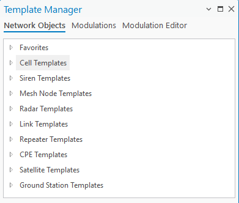
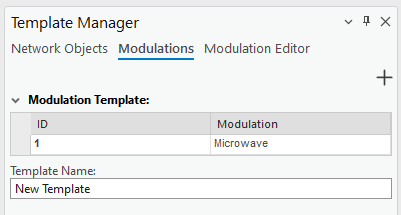
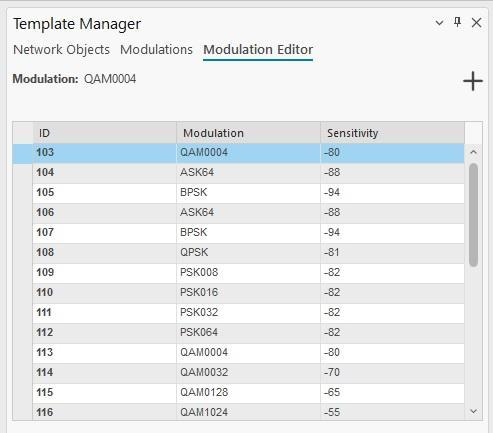

# Template Manager

Template Manager lets you edit the current project's templates residing in the various Template tables of `default.gdb`. You can change the field values of templates, and create new or delete existing ones.

Templates are essential tools that streamline and simplify configuration by predefining parameters automatically. Their primary purpose is to save time and reduce the risk of human error during setup, particularly in complex scenarios like wireless network configuration:

1. **Automatic Parameter Filling** — templates automatically populate required parameters, eliminating the need to input them one by one. This ensures consistency and speeds up setup, especially with large datasets or multiple network layers (cells, sites, CPEs, etc.).
2. **Error Prevention** — if a parameter is inadvertently missed during manual configuration, templates act as a safeguard, ensuring all necessary parameters are accounted for.
3. **Coverage Prediction Assurance** — if a parameter in a network layer object is forgotten or overlooked, the template provides a fallback so the prediction can still run accurately and without interruption.

Templates can be marked as favorites in Template Manager with a single click. Favorite templates are visually distinguished and appear at the top of every template selection list in the application — including Add Object and RF Prediction tools — separated from the remaining templates. The ordering always reflects the current favorite status, so newly starred templates move to the top the next time a picker is opened.

The templates are divided into categories:

- **Network Objects** — edit and manage network object templates (cells, sites, links, etc.). Templates are divided by network layer, each with a unique template structure based on the parameters available for that layer.
- **Modulations** — create modulation configurations used for MW links and Radios.
- **Modulation Editor** — create single modulations, for use in the Modulations tab.

## Edit Network Objects Template

Click the Template Manager button to open the dialog, then select one of the listed templates to edit it.

| Button | Description |
|---|---|
| Save Changes | Saves the changes to the object. |
| Dismiss | Cancels the changes and closes the dialog. |

## Manage Network Object Template

Right-click a selected template to open a context menu with **Duplicate** and **Delete** options:

- **Duplicate** creates a new template with the same parameters.
- **Delete** removes the selected template.

Click the star icon to the left of a template to mark it as a favorite. A solid star indicates the template is marked as favorite, and it appears in the **Favorites** category at the top of the Network Objects list. Click the star again to unmark it — a transparent star indicates the template is not marked as favorite.

## Modulations

Modulations are used in MW link calculations, and can specifically be defined for [Radios](5-13-rlp/5-13-1-radios.md). Instead of specifying modulations one by one, you can create a set of them in this tab.

To preview and edit a Modulations template, click it in the table.

| Control | Description |
|---|---|
| + (top right) | Initializes a new modulation template with default values. |
| × | Removes the modulation. |
| Save Changes | Saves all changes. |
| Dismiss | Discards changes. |

To create a new Modulation template, press the **+** button in the top-right corner to initialize a new template, then set the **Template name** and use the modulation dropdown list below it to assign modulations to the template. Once the changes are made, click **Create** at the bottom of the window to create the new modulation template.

## Modulation Editor

The list of available modulations shown in the Modulations tab is taken from the Modulation Editor tab.

To add a new modulation, click **+** at the top right of the Modulation Editor window to initialize a new modulation with default values, then press **Create** at the bottom of the window. Alternatively, click an existing modulation to edit its parameters.

| Button | Description |
|---|---|
| Create | Creates a new modulation with the specified parameters. |
| Save Changes | Applies changes to the currently selected modulation. Disabled if the modulation has not been created. |
| Cancel | Discards changes made to the modulation. |
