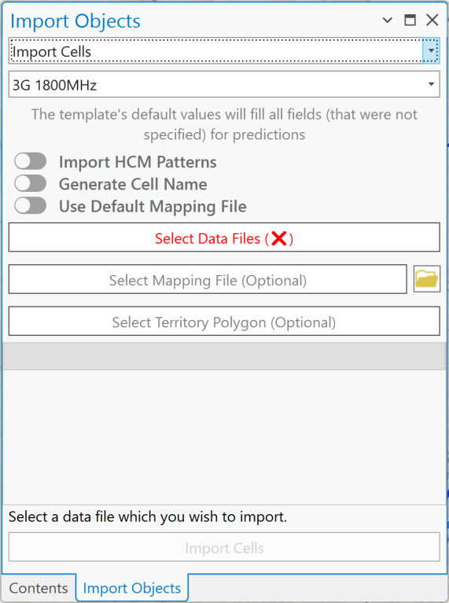
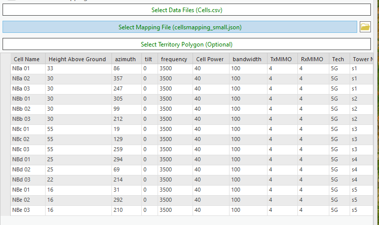
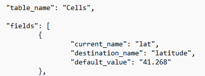

# Import Objects

Import Objects lets you bring network objects in from external documents, without creating them manually — invaluable for extensive or complex datasets. Cellular Expert for ArcGIS Pro supports importing three widely used file formats: `.xls`, `.xlsx`, and `.csv`. For mapping files, it supports `.json`.

Key benefits:

- **Time-saving** — instead of manually entering or recreating network objects, quickly import data from existing documents, significantly reducing setup time.
- **Data consistency** — importing keeps all network objects consistent with the original data source, minimizing discrepancies and errors.
- **Support for multiple formats** — `.xls`, `.xlsx`, and `.csv` support integrates with a variety of data workflows.

Click the Import Objects button to open the dialog. Expand the **Import** dropdown menu and select the object to import — the dialog is filled with options to define the data and mapping files.

> **Note:** The exact object types available in the Import dropdown depend on the module — for example, RCP's dialog offers Sites, Radar, CPE, Sirens, and Repeaters (in addition to Cells); RLP's offers Sites, Radar, CPE, Repeaters, Links, and Mesh Nodes. Only the object types with a documented [dedicated Add Object workflow](5-1-network-objects-overview.md#object-availability-by-module) for a given module are confirmed as fully supported end-to-end for that module.

## Import Cells

Importing Cells has additional parameters compared to other import options.

| Field | Description |
|---|---|
| Template | Takes necessary parameters from the template during import. Template values are used when parameters are missing from the text file and mapping file. |
| Import HCM Patterns | Antenna patterns are created and imported based on specific antenna name values provided in an HCM agreement. Requires the data files to have an `antenna_type` field. |
| Generate Cell Name | Generates a cell name for all selected cells based on these parameters, in this exact order: `longitude`, `latitude`, `height`, `azimuth`, `power`, `antenna_gain`, `frequency`. Missing fields are skipped. |
| Use Default Mapping File | Applies a default mapping file to the imported data. |
| Select Data Files | Opens a dialog to select the files defining the network objects to import. Supported formats: `.xls`, `.xlsx`, `.csv`, and tables from an `.sde` connection. The button turns green on a successful selection. |
| Select Mapping File (Optional) | Opens a dialog to select the file (`.json`) that defines the data to import and the conditions under which it is processed. The button turns green on a successful selection. See [Mapping file](#mapping-file) below. |
| Select Territory Polygon (Optional) | Restricts the import to objects within a selected polygon area. |

### Steps

1. Click **Select Data Files** and choose your text file — it loads into the dialog.

   

2. If your data structure differs from the Cellular Expert database, use a mapping file to map your data structure to the Cellular Expert workspace's Cells layer structure.
3. Click **Import Cells** to start the import.

Sites can be imported together with Cells if:

- The mapping file is not used, and the text file has a `site_id` field containing the Site name (as text data), or
- The mapping file is used, and the data is mapped to the `site_id` field (as text data).

### Mapping File

Data in the import files may have names, values, and units that don't match the Cellular Expert database. An additional mapping file resolves such conflicts.

An empty mapping file can be found in the project's workspace catalog, in the `SystemFiles` folder. Mapping files are not necessary if the import file data already corresponds to the Cellular Expert database — otherwise, a mapping file is required for a successful import. Values not mentioned in the mapping file are unaffected.

Mapping file structure:

| Key | Description |
|---|---|
| `table_name` | Defines which network object's values are being mapped. |
| `current_name` | The name of the value as written in the data file — e.g. `lat`, a column name in the data file. |
| `destination_name` | The proper property name (table column name) in the Cellular Expert database — e.g. `latitude`, to which `lat` is renamed on import. This property is validated when the mapping file is imported. |
| `default_value` | The value used when an object in the data file has no value for a particular property — e.g. `41.258` as a default for `latitude`. An empty string (`""`) means no default value is applied. |

## Import Other Network Objects

Other network objects — Sites, Radar, CPE, Sirens, Repeaters, Links, or Mesh Nodes, depending on the module — can be imported into the Cellular Expert workspace using the same dialog.

| Field | Description |
|---|---|
| Template | Takes necessary parameters from the template during import. Template values are used when parameters are missing from the text file and mapping file. |
| Select Data Files | Opens a dialog to select the files defining the network objects to import. Supported formats: `.xls`, `.xlsx`, `.csv`, and tables from an `.sde` connection. The button turns green on a successful selection. |
| Select Mapping File (Optional) | Opens a dialog to select the `.json` file defining the data to import and how it is processed. The button turns green on a successful selection. |
