# Profile

A Profile in wireless communication represents the geographical and environmental characteristics of the path between a transmitter and a receiver. It includes detailed information such as elevation data, terrain heights, and any obstacles (e.g. buildings, trees, or mountains) that might impact signal propagation.

All relevant calculations are already performed within the system. These include the power budget, which factors in the total power available for transmission and reception while accounting for system gains and losses, and the path loss, which measures the reduction in signal strength due to distance, frequency, and environmental obstructions. The profile also provides the calculated angles, including the elevation angle (vertical angle between the transmitter and receiver) and the azimuth angle (horizontal direction). Additionally, it determines whether a direct line-of-sight exists between the two points.

This comprehensive information is ready for use, enabling users to assess the feasibility and performance of a communication link for network planning, optimization, and troubleshooting.

Click the Profile button to open the Profile dialog. The Profile tool enables you to determine the obstructions, elevation, and Fresnel zones between two points on a map.

## Profile Tool

### Properties

> **Applies to:** SAT, RCP, RLP.
>
> **Profile: Profile Selection** — Profile selection allows for quick switching between profiles while retaining the most recently defined parameters. This feature is especially useful for comparing and verifying calculations across different Tx and Rx configurations. When a new profile is created, it is automatically assigned a name and appears in the Profile Selection option. A profile can be saved or removed from the list.
>
> | Button | Description |
> |---|---|
> | Save | The option saves the profile to the Docs Manager tool with all defined parameters. |
> | Close | Removes the profile from the list in Profile Selection. |
> | Close All | Removes all profiles from the Profile Selection list. |
>
> The PDF manuals document Profile Selection explicitly for SAT, RCP, and RLP. This does not establish that Sound, EMF, or Indoor lack the underlying functionality — their absence from those manuals is treated as unresolved documentation information, not a confirmed limitation.

#### General

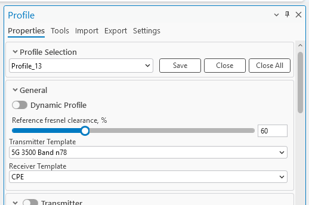

| Parameter | Description |
|---|---|
| Fresnel Minimal Clearance, % | Percentage by which the primary Fresnel zones will be scaled up or down, thus creating a secondary Fresnel zone. The percentage must be in the range of 1 to 200. The value can be changed either by inputting it manually or by using the slider. |
| Transmitter Template | The template that is used for the transmitter's default values. |
| Receiver Template | The template that is used for the receiver's default values. |

#### Transmitter

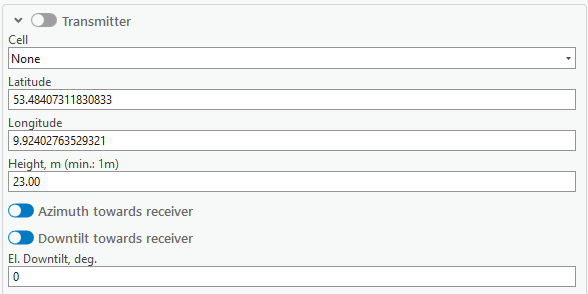

| Parameter | Description |
|---|---|
| Transmitter (toggle) | Toggling the switch to the left of Transmitter enables the Fixed Transmitter functionality, which modifies only the receiver's positioning when drawing the profile on the map. |
| Cell | A cell from which the profile will be drawn. The parameters of the cell will be taken into the calculation if the cell is snapped to by the profile tool. |
| Latitude | Decimal degrees Y type coordinate. |
| Longitude | Decimal degrees X type coordinate. |
| Height, m | Height above the ground, in meters. The minimum value must be 1 m. |
| Azimuth towards receiver | Enabled by default. When enabled, the transmitter's azimuth is towards the receiver. Disabling this option would take the azimuth value from the Cell object, and use it for FWA Power Budget calculations; it also allows the user to enter a custom azimuth value for the transmitter. |
| Downtilt towards receiver | Enabled by default. When enabled, the transmitter's tilt is towards the receiver. Disabling this option would take the tilt value from the Cell object, and use it for FWA Power Budget calculations; it allows the user to enter a custom tilt value for the transmitter. |
| El. Downtilt, deg | Electrical downtilt value for the transmitter, in degrees. |

The antenna for the transmitter can be selected from the table below the El. Downtilt, deg input. Its pattern can be viewed by clicking the **View Antenna** button on the right side.

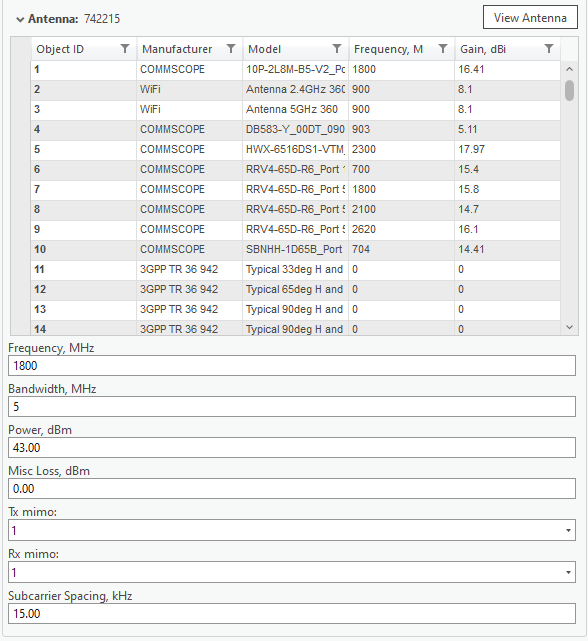

| Parameter | Description |
|---|---|
| Frequency | Frequency of the transmitter. |
| Bandwidth, MHz | Bandwidth of the transmitter. |
| Power, dBm | A power that the transmitter possesses. |
| Misc Loss, dB | Miscellaneous loss value in dB. Value is not required. |
| Tx Mimo | Transmitter antenna count. Available values: 1, 2, 4, 8, 16, 32, 64. |
| Rx Mimo | Receiver antenna count. Available values: 1, 2, 4, 8, 16, 32, 64. |
| Subcarrier Spacing | Value in kHz. |

#### Receiver

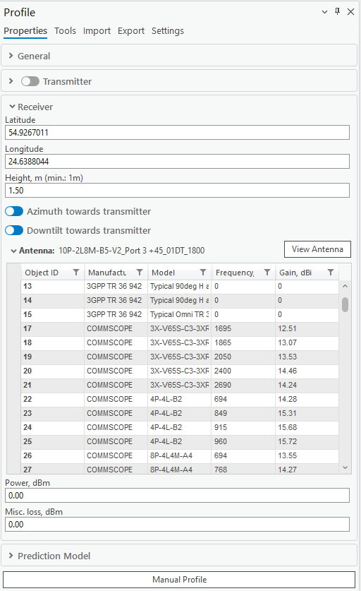

| Parameter | Description |
|---|---|
| Latitude | Decimal degrees Y type coordinate. |
| Longitude | Decimal degrees X type coordinate. |
| Height, m | Height above the ground, in meters. The minimum value must be 1 m. |
| Azimuth towards transmitter | Enabled by default. When enabled, the receiver's azimuth is towards the transmitter. Disabling this option would take the azimuth value from the receiver (Cell) object, and use it for FWA Power Budget calculations; it also allows the user to enter a custom azimuth value for the receiver. |
| Downtilt towards transmitter | Enabled by default. When enabled, the receiver's tilt is towards the transmitter. Disabling this option would take the tilt value from the receiver (Cell) object, and use it for FWA Power Budget calculations; it allows the user to enter a custom tilt value for the receiver. |
| Power, dBm | A power that the receiver possesses. |
| Misc Loss, dB | Miscellaneous loss value in dB. Value is not required. |

#### Prediction Model

Double-click the prediction model from the list to select it for the profile.

### Draw Profile

When the Profile tool is selected and enabled, you will be able to select two points on the map in turn, creating a Profile line.

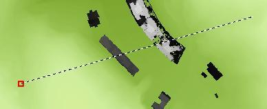

The profile also lets you snap to different Cellular Expert network objects. If the object to which the user snaps is a cell, all parameters of that cell that are necessary to draw a profile will be read and included in the calculations. If the object is not a cell, then only the name and the object's coordinates will be taken.

Most of these values will be displayed in the Profile pane shown above. If you change the values in the pane, these changes will be reflected in the Profile plot by redrawing it.

Upon the selection of a second point, these geometries will be created between the points:

| Geometry | Color | Description |
|---|---|---|
| LOS | Green | The distance until the first obstruction in the profile's way. |
| OLOS | Orange | The distance until the first clutter LOS obstruction. |
| NLOS | Red | The obstructed path between the sender and receiver. |
| Lowest Clearance | Yellow | The point at which NLOS has the lowest clearance to the obstacle. |
| Rx | Purple | The receiver point. |
| Tx | Green | The transmitter point. |
| Fresnel | Blue | The Fresnel lines. |

The Profile plot illustrating these geometries, obstacles (buildings), and the Fresnel zone will appear in a dockpane below. You can inspect the values at particular points by moving the cursor around the plot. The cursor movement on the plot will be projected as a moving point on the map. If a cell is selected for the transmitter, the cell's tilt (the sum of mechanical and electrical tilts) and vertical beamwidth are displayed as additional symbols: a light blue line and a darker blue cone, respectively. The length of the cell tilt and antenna vertical beamwidth symbols is the radius of the prediction model selected for the cell.

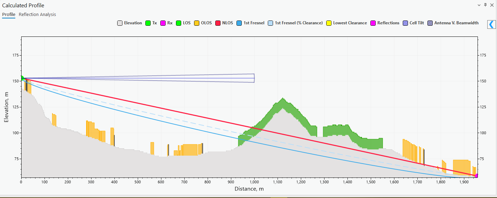

The button allows you to see the Prediction Calculation results.

You can change the colors of the profile by clicking the colored squares near the names of the parameters. The colors will be updated automatically. You can toggle the visibility of each separate parameter of the profile by clicking on the name of the element. Enabled elements are indicated by bold text, and disabled elements are indicated by regular text.

You can change the height of the transmitter/receiver points by dragging their ends on the plot.

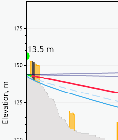

Hovering the cursor over the plot displays a tooltip with the meter values for profile, building, clutter, elevation, distance, etc., as well as their representations in colors.

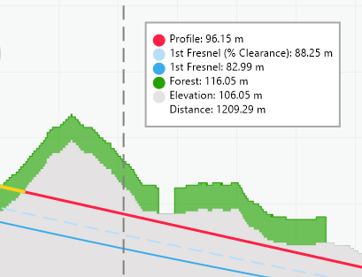

#### Profile Results

Clicking the Results tab of the Calculated Profile dockpane shows the full prediction calculation output for the drawn profile:

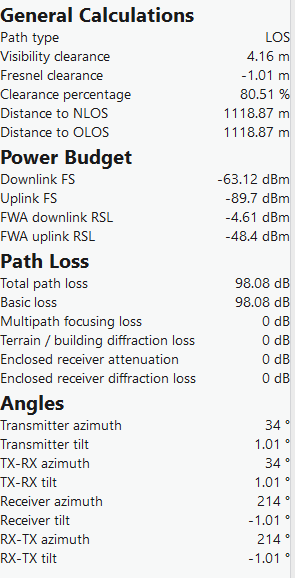

| Group | Field | Description |
|---|---|---|
| General Calculations | Path type | The visibility condition of the path — LOS, OLOS, or NLOS. |
| General Calculations | Visibility clearance, m | The clearance distance for the determined visibility condition. |
| General Calculations | Fresnel clearance, m | The clearance of the path relative to the Fresnel zone. |
| General Calculations | Clearance percentage, % | The percentage of Fresnel zone clearance. |
| General Calculations | Distance to NLOS, m | Distance to the nearest NLOS obstruction. |
| General Calculations | Distance to OLOS, m | Distance to the nearest OLOS obstruction. |
| Power Budget | Downlink FS, dBm | Downlink free-space signal level. |
| Power Budget | Uplink FS, dBm | Uplink free-space signal level. |
| Power Budget | FWA downlink RSL, dBm | FWA downlink Received Signal Level. |
| Power Budget | FWA uplink RSL, dBm | FWA uplink Received Signal Level. |
| Path Loss | Total path loss, dB | The total calculated path loss. |
| Path Loss | Basic loss, dB | The basic (free-space) loss component. |
| Path Loss | Multipath focusing loss, dB | Loss/gain due to multipath focusing effects. |
| Path Loss | Terrain/building diffraction loss, dB | Loss due to diffraction over terrain or buildings. |
| Path Loss | Enclosed receiver attenuation, dB | Attenuation applied when the receiver is enclosed in clutter. |
| Path Loss | Enclosed receiver diffraction loss, dB | Diffraction loss applied when the receiver is enclosed in clutter. |
| Angles | Transmitter azimuth, ° | Azimuth of the transmitter. |
| Angles | Transmitter tilt, ° | Tilt of the transmitter. |
| Angles | TX-RX azimuth, ° | Azimuth from transmitter to receiver. |
| Angles | TX-RX tilt, ° | Tilt from transmitter to receiver. |
| Angles | Receiver azimuth, ° | Azimuth of the receiver. |
| Angles | Receiver tilt, ° | Tilt of the receiver. |
| Angles | RX-TX azimuth, ° | Azimuth from receiver to transmitter. |
| Angles | RX-TX tilt, ° | Tilt from receiver to transmitter. |

### Adjust Data

Adjust Data is found on the Profile Plot dockpane near the Results. The tool lets you change the elevation, building, and clutter data of the area visible in the profile plot.

When the Adjust tab is opened, select a desirable range for the data adjustment on the plot.

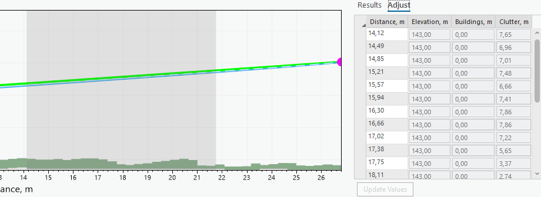

You can make slight changes to the range of the selection area by hovering over the area's edges and dragging them. To adjust the values, click on one of the text boxes and insert the value. To change multiple values simultaneously, drag across the adjustment table and select multiple rows. Changing the value of a single text box will also change all the other chosen rows' values in that text box. The selected area will be highlighted on the profile plot.

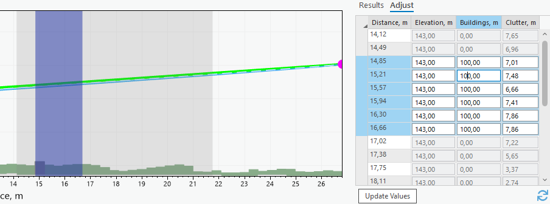

To update the values, either select an unselected row or press the Update Values button. To reset the adjusted values to defaults, click the Refresh button.

### Manual Profile

If you want to insert specific coordinates and draw a profile that way, you can insert these values in the Profile pane and click the **Manual Profile** button.

### Dynamic Profile

The button toggles the Dynamic Profile. Dynamic Profile lets you see Profile calculations and the plot being drawn in real time as the cursor moves. Whenever the cursor stops momentarily, the profile gets drawn. The transmitter point needs to be entered for the dynamic profile to be activated. The previous transmitter point will be chosen if the point is not currently entered.

If a second point is selected while the profile is being drawn, the dynamic profile will be disabled, and the LOS lines will appear on the map.

### Tools

The Tools tab also includes a collapsed **Antenna Height Optimizer** section, alongside **Reflections** and **Reflection Analysis** (the source manuals do not otherwise document the Antenna Height Optimizer's behavior).

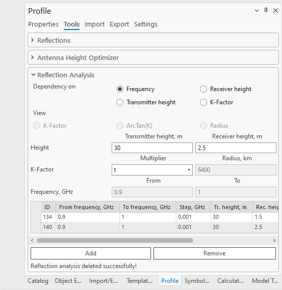

Reflections are considered in profile and RF calculations to assess how radio waves bounce off surfaces, affecting signal path and strength.

To enable reflections, select either **Single** or **Multipath Reflection**. Be aware that if reflections are not visible, you may need to adjust the height of the receiver/transmitter accordingly. It is recommended to disable the Step Plot of the profile before using Reflections (see Settings).

**Use Single Reflection** enables a reflection that reflects straight from the transmitter to the receiver point, with the smallest angle.

| Parameter | Description |
|---|---|
| Use Multipath Reflections | Enable all reflections that happen along the profile line. |
| Use Divergence Factor | Quantifies the extent to which a reflected signal spreads out, affecting its strength and coverage. |
| Step Size | The length period by which the reflection will be calculated. The step size is determined by taking the average cell size of the elevation raster. |
| Polarizations | The polarization of reflections (vertical or horizontal). |
| Use Clutter Classes | Enables the use of default clutter classes for the reflection calculations (see [Clutter Classes](5-data-management/5-5-clutter-classes.md)). If disabled, custom values may be used for conductivity and permittivity. |

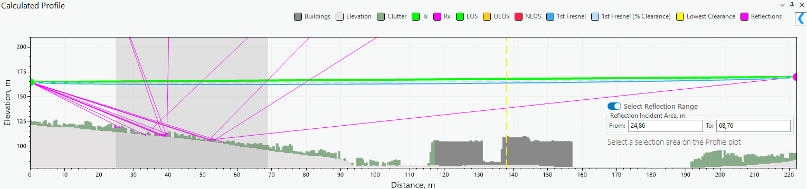

**Select Reflection Range** lets you set a range in which the reflection calculations should happen. This will affect both Single and Multipath reflections and help highlight specific important areas along the profile as well as speed up the calculation process. The range will be enabled as soon as a profile is drawn. You can select this range on the plot by holding down the left mouse button and dragging across the screen.

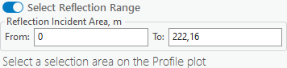

Reflection results will appear in the Profile Results table, under a **Reflections** group:

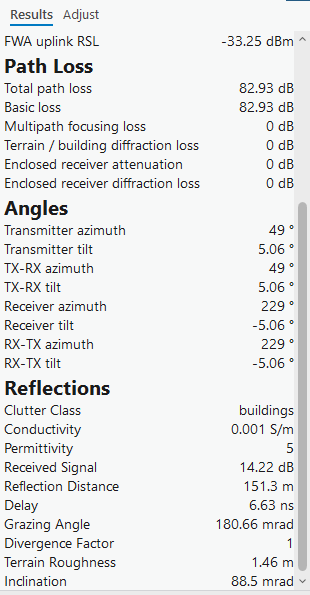

| Field | Description |
|---|---|
| Clutter Class | The clutter class at the reflection point. |
| Conductivity, S/m | Surface conductivity at the reflection point. |
| Permittivity | Relative permittivity at the reflection point. |
| Received Signal, dB | The received signal level contributed by this reflection. |
| Reflection Distance, m | Distance from the transmitter to the reflection point. |
| Delay, ns | The propagation delay introduced by the reflection. |
| Grazing Angle, mrad | The grazing angle of the reflected ray. |
| Divergence Factor | The divergence factor applied to the reflection. |
| Terrain Roughness, m | The terrain roughness at the reflection point. |
| Inclination, mrad | The inclination of the terrain at the reflection point. |

### Reflection Analysis

The Reflection Analysis tool for Profile is designed to help analyze and visualize signal reflections based on the changes in various profile parameters like frequency, transmitter height, receiver height, and K-factor. Reflections must be enabled to perform analysis, and the Single Reflection option is automatically enabled when the tool is selected.

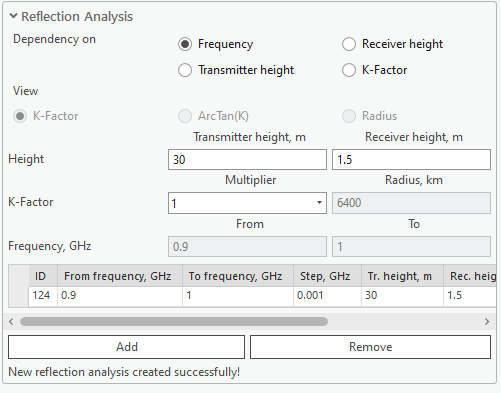

| Parameter | Description |
|---|---|
| Dependency on Frequency | Calculate reflection analysis based on frequency range (from GHz to GHz). |
| Dependency on Receiver height | Calculate reflection analysis based on receiver height range (from m to m). |
| Dependency on Transmitter height | Calculate reflection analysis based on transmitter height range (from m to m). |
| Dependency on K-Factor | Calculate reflection analysis based on K-factor range (from radius, km to radius, km). |

The reflection analysis results for each type of dependency are displayed in the Reflection Analysis tab of the Calculated Profile window.

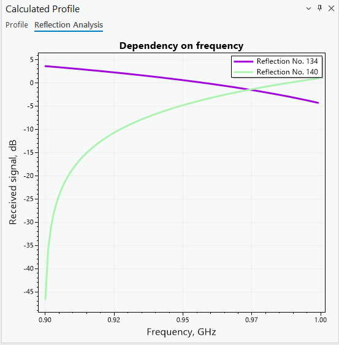

### Import

Import a profile by selecting a profile file in the Import section. Supported formats: `.pl2` (path loss file). Once imported successfully, the profile data may then be customized.

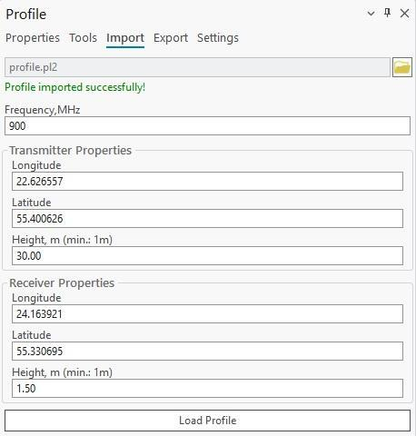

**Load Profile** creates the profile with the provided data.

### Export (Profile Report)

The input data and calculation results can be automatically transferred into a Profile Report. This report will show transmitter/receiver input data, calculation results, as well as the Profile plot and map view in which the profile was drawn. The report can be exported in PDF and PL2 formats.

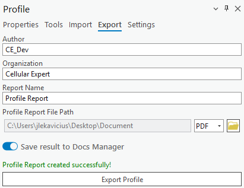

> **Note:** The Profile Report can also be saved directly to [Docs Manager](4-workspace/4-1-workspace.md#docs-manager) by enabling **Save result to Docs Manager** in the Export tab, so it can be reopened later even if the exported file is deleted.

The resulting Profile report will look similar to this example:

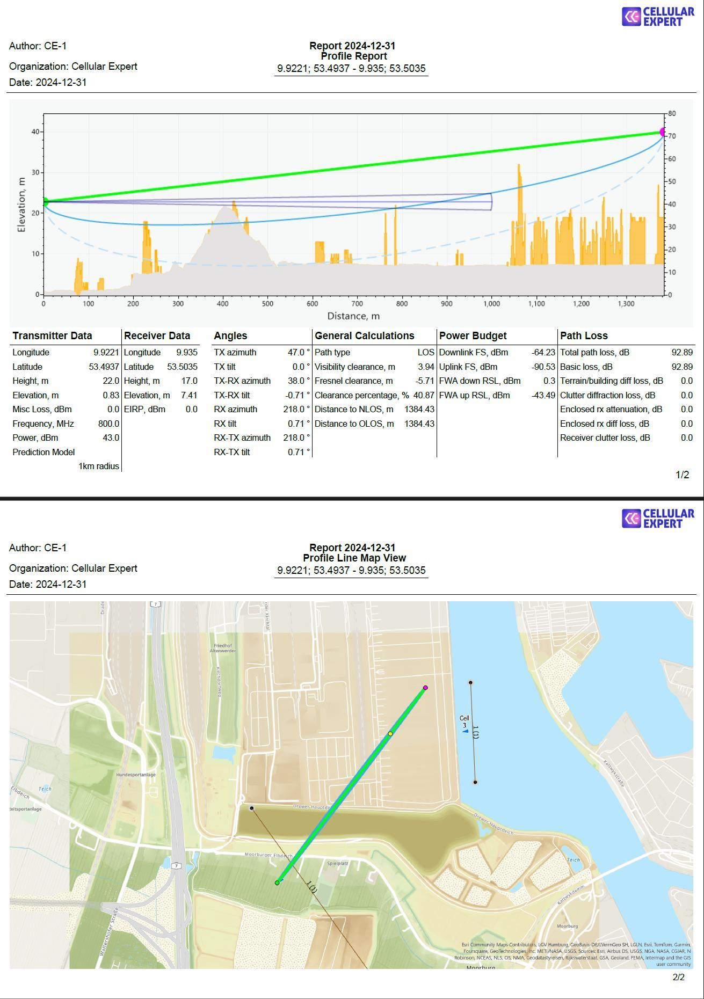

### Settings

Currently, you can configure the profile's visual properties and controls in Profile settings. The settings can be changed once a profile is drawn.

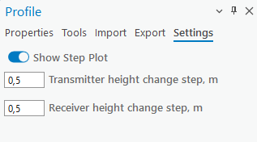

| Parameter | Description |
|---|---|
| Show Step Plot | Display data points as a series of steps rather than a smooth line or individual points. |
| Transmitter height change step | The step (in meters) for changing the transmitter height when dragging it in the Profile graph. The default value is 0.5 meters. |
| Receiver height change step | The step (in meters) for changing the receiver height when dragging it in the Profile graph. The default value is 0.5 meters. |
