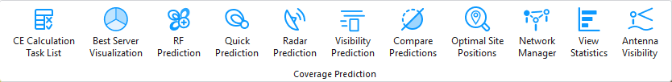
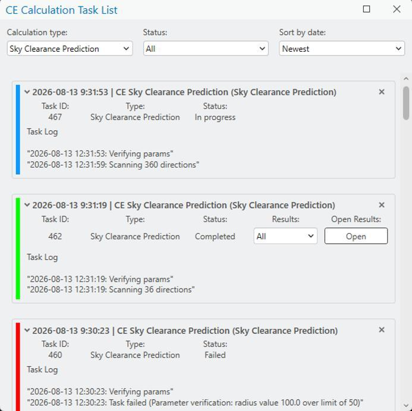

# CE Calculation Task List

All results of the prediction calculations can be found in the CE Calculation Task List tab. This includes failed and successful calculations.

Click the CE Calculation Task List button to open the dialog.

## Task Status

The task list refreshes automatically once calculation tasks are run. The task status is indicated by three main colors:

| Color | Status |
|---|---|
| Blue | In progress |
| Green | Completed |
| Red | Failed |

Calculation tasks can be deleted from the task list by clicking the button on the right side of the task.

## Results

To open a result raster, select it from the results dropdown and click **Open Results**.

> **Note:** Available calculation types depend on the installed CE Pro license and modules.

## Filtering

Filtering by calculation type spans these categories: Antenna Visibility Prediction, EMF Calculation, Link Prediction, Model Tuning, Optimal Site Positions Calculation, RF Prediction, Radar Prediction, Siren Sound Prediction, Visibility Prediction, and Sky Clearance Prediction.

Filtering by status spans these types: All, in progress, completed, failed.

## Sorting

The tasks can also be sorted by date, either newest or oldest first.
