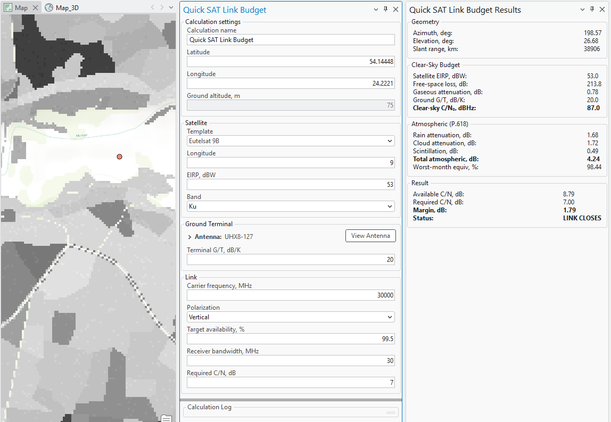

# Quick SAT Link Budget

> **Applies to:** SAT.

Click the Quick SAT Link Budget button to open the dialog. The CE Quick SAT Link Budget tool performs downlink link budget calculations for satellite-to-terminal paths.

The calculation includes free-space path loss, atmospheric absorption according to ITU-R P.676, rain attenuation according to ITU-R P.618, satellite EIRP and ground terminal G/T, carrier-to-noise ratio (C/N), and link margin. Results are presented in a dedicated satellite link budget results panel that shows all intermediate values of the budget.

| Field | Description |
|---|---|
| Calculation name | Name of the calculation. |
| Latitude / Longitude | Ground terminal location. |
| Ground altitude, m | Ground elevation at the terminal location. |
| Satellite Template | The satellite template used for the calculation. |
| Satellite Longitude | Orbital longitude of the satellite. |
| EIRP, dBW | Satellite effective isotropic radiated power. |
| Band | Frequency band (e.g. Ku). |
| Antenna | Ground terminal antenna — click **View Antenna** to inspect its pattern. |
| Terminal G/T, dB/K | Ratio of antenna gain to system noise temperature. |
| Carrier frequency, MHz | The downlink carrier frequency. |
| Polarization | Signal polarization. |
| Target availability, % | Percentage of an average year for which the link must remain available. |
| Receiver bandwidth, MHz | Channel bandwidth. |
| Required C/N, dB | Minimum carrier-to-noise ratio needed for the link to close. |

**Results panel:**

| Group | Field | Description |
|---|---|---|
| Geometry | Azimuth, deg | Azimuth look angle to the satellite. |
| Geometry | Elevation, deg | Elevation look angle to the satellite. |
| Geometry | Slant range, km | Distance from the ground terminal to the satellite. |
| Clear-Sky Budget | Satellite EIRP, dBW | Effective isotropic radiated power of the satellite. |
| Clear-Sky Budget | Free-space loss, dB | Free-space path loss. |
| Clear-Sky Budget | Gaseous attenuation, dB | Atmospheric gaseous attenuation, per ITU-R P.676. |
| Clear-Sky Budget | Ground G/T, dB/K | Ground terminal's gain-to-noise-temperature ratio. |
| Clear-Sky Budget | Clear-sky C/N₀, dBHz | Carrier-to-noise-density ratio under clear-sky conditions. |
| Atmospheric (P.618) | Rain attenuation, dB | Rain attenuation, per ITU-R P.618. |
| Atmospheric (P.618) | Cloud attenuation, dB | Attenuation due to cloud cover. |
| Atmospheric (P.618) | Scintillation, dB | Signal scintillation loss. |
| Atmospheric (P.618) | Total atmospheric, dB | Combined atmospheric losses. |
| Atmospheric (P.618) | Worst-month equiv., % | Worst-month equivalent availability percentage. |
| Result | Available C/N, dB | The calculated available carrier-to-noise ratio. |
| Result | Required C/N, dB | The required carrier-to-noise ratio (input value). |
| Result | Margin, dB | The link margin (Available C/N − Required C/N). |
| Result | Status | Whether the link closes (e.g. `LINK CLOSES`) or fails. |
