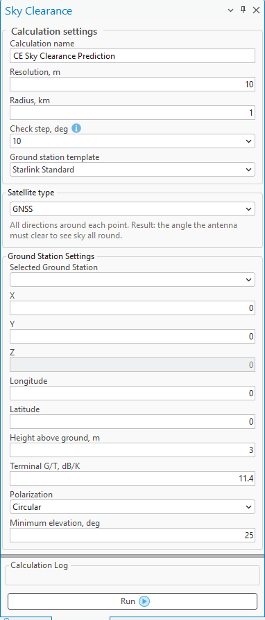
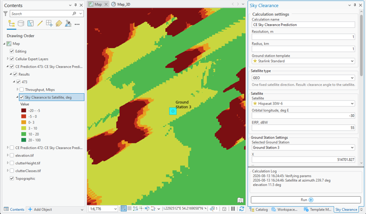

# Sky Clearance

> **Applies to:** SAT.

Click the Sky Clearance button to open the dialog. The Sky Clearance tool determines whether a ground station at a given location can see the required sky, accounting for terrain, buildings, and vegetation. An analysis point is set by clicking the map or by selecting an existing ground station, and results are produced as rasters over a configurable radius around it. Obstruction is derived from elevation and clutter data, and the search distance for blocking terrain is automatically determined by the surrounding relief and the satellite elevation angle.

When the Sky Clearance button is pressed, a map tool is activated which lets you select a point on the map. Upon selecting this point and pressing the **Run** button, a visual representation of the calculation is rendered on the map, and the relevant data is presented in the [CE Calculation Task List](../7-1-ce-calculation-task-list.md).

## Sky Clearance Parameters

| Parameter | Description |
|---|---|
| Calculation Name | Name of the calculation that will be displayed in the CE Calculation Task List. |
| Resolution | Resolution for raster calculations. The output rasters will be produced with the indicated cell size. |
| Check step | Out of 360 degrees, the step used (e.g. every 10 degrees) for obstacle analysis. A lower step results in more accurate calculations but a longer calculation time. Value in degrees. |
| Ground station template | Ground Station Template used in the prediction calculations. |
| Satellite type | GNSS, GEO, or LEO. Different type selections result in different calculation types. |
| Antenna | Antenna used in the prediction calculations. |
| Selected Ground Station (Optional) | A ground station from which the calculation will be done. |
| X, Y, Z | Coordinates in the projected coordinate system. |
| Latitude | Decimal degrees Y type coordinate in the WGS 1984 geographical coordinate system. |
| Longitude | Decimal degrees X type coordinate in the WGS 1984 geographical coordinate system. |
| Height above ground | Ground station height above the ground, in meters. |
| Antenna | Defines the antenna pattern for the Ground Station object. |
| Terminal G/T | Ratio of antenna gain to system noise temperature. Determines the terminal's receive sensitivity. Value in dB/K. |
| Minimum elevation | Lowest elevation angle at which the terminal can use a satellite. Value in degrees. |
| Polarization | Signal polarization: Horizontal, Vertical, or Circular. |
| Band | Frequency band of the terminal, such as Ka, Ku, or C. |
| EIRP | Effective isotropic radiated power of the terminal. Value in dBW. |
| Frequency | Transmit (uplink) frequency. Value in MHz. |
| Bandwidth | Channel bandwidth. Value in MHz. |
| Required C/N | Minimum carrier-to-noise ratio needed for the link to close. Value in dB. |
| Constellation altitude (LEO) | Orbital height of the LEO constellation above the Earth's surface. Used to determine the slant range to the satellites. Typical values are around 550 km for Starlink and 1200 km for OneWeb. Value in km. |
| Target availability | Percentage of an average year for which the link must remain available. Determines how much rain and atmospheric fading the budget allows for — higher availability requires a larger margin and produces a more conservative result. |
| Orbital longitude (GEO) | Longitude of the geostationary satellite's orbital slot. Together with the ground station location, it determines the elevation and azimuth look angles to the satellite. Negative values indicate positions west of the Greenwich meridian. Value in degrees east. |

## Results

Results depend on the selected satellite type mode:

- **GEO** — a geostationary satellite occupies a single fixed direction in the sky. The tool reports the clearance angle to that satellite at every point: positive where the dish sees it, negative where terrain or clutter blocks the line of sight.
- **LEO** — constellations such as Starlink and OneWeb use the whole sky above a minimum elevation angle. The tool reports the percentage of that usable sky which is unobstructed.

