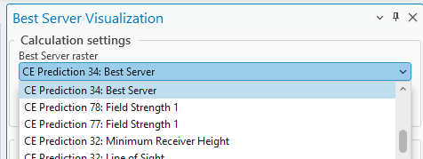

# Best Server Visualization

> **Applies to:** RCP.

This tool is designed to generate network object names for the Best Server raster. Loading the Best Server raster with attribute information into the Table of Contents can be time-consuming after RF prediction, audibility prediction, or other analyses. To streamline this process, a separate tool has been introduced that efficiently generates additional information for the Best Server raster. The tool allows users to define the network object type and select the prediction raster (Best Server).

1. Select the calculation result.
2. Select the network object type.
3. Press **Run** to generate object names for the selected prediction raster.
