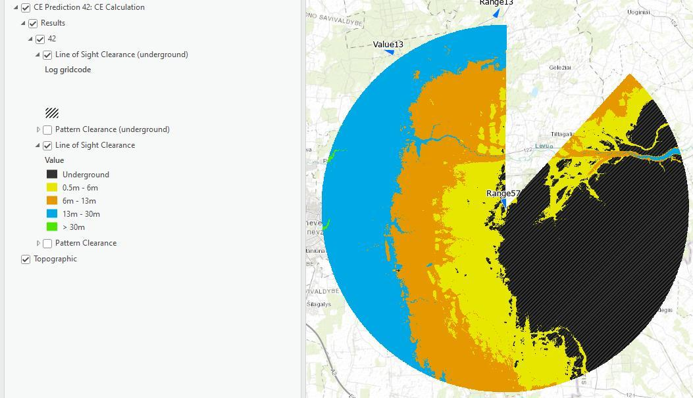

# Antenna Visibility

> **Applies to:** RCP.

The Antenna Visibility prediction tool is designed to calculate and visualize the coverage and visibility of selected antennas, based on cell parameters, input resolution, and attenuation threshold. This feature considers various factors such as antenna patterns, azimuth, and beamwidth to generate detailed visibility maps.

Click the Antenna Visibility button to open the dialog.

| Parameter | Description |
|---|---|
| Calculation Name | Antenna Visibility prediction identification. |
| Resolution, m | Resolution of the visibility prediction rasters. |
| Cell template | Cell template for visibility prediction calculations. |
| Attenuation threshold, dB | Maximum allowable signal loss for determining effective signal visibility. |

Select the cells on the map and press **Run** to perform the antenna visibility calculations. Once the calculations are performed, a new group layer is added with **Line of Sight Clearance**, **Pattern Clearance**, **Line of Sight Clearance (underground)**, and **Pattern Clearance (underground)** layers.

Toggling either the Line of Sight Clearance or Pattern Clearance layers shows the legend according to the values in the raster. Additional "underground" polygon groups are drawn with hatch fill to indicate the values of `0` (blocked by elevation or an obstacle) for each layer.

> **Note:** The default Line of Sight Clearance and Pattern Clearance layer files (`.lyr`) can be changed in [Workspace Properties](../../4-workspace/4-1-workspace.md#workspace-properties), under the Visualization tab and the Visibility category.
