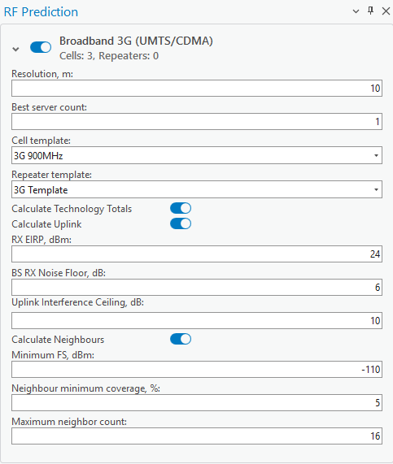

# Broadband 3G (UMTS/CDMA)

> **Applies to:** RCP.

Cells are automatically divided into sections based on the technology attribute. Select cells on the map and click the RF Prediction button to open the RF Prediction dialog — based on the selection, the cells are divided into technologies (Narrowband 2G, Broadband 3G, Broadband 4G, Broadband 5G, WiFi).

| Common Parameter | Description |
|---|---|
| Calculation Name | The name of the calculation will be displayed in the [CE Calculation Task List](../../7-1-ce-calculation-task-list.md). |
| Open raster after completion | Displays the prediction visualization (raster) after successful prediction calculation. |
| Recalculate Objection Position | Reviews the current X/Y and Longitude/Latitude values in the selected Cells table, and corrects them if these values differ from the object's geometry. |
| Calculate 3D | Runs calculations at different receiver heights and, after completion, creates a single Voxel file to visualize Field Strength values in a 3D scene. |
| Run | Starts the prediction calculation. |

## Broadband 3G Parameters

| Parameter | Description |
|---|---|
| Resolution | Resolution for raster calculations. The output rasters will be produced with the indicated cell size. |
| Best server count | Option to calculate up to 5 best servers. The prediction rasters show the 1st, 2nd, 3rd, and so on strongest signal sources. |
| Cell Template | Option to use the parameters from the template if the cell misses the required parameters. |
| Repeater Template | Option to use the parameters from the template if repeaters are selected and they are missing the required parameters. |
| Calculate Technology Totals | Combines all resulting Field Strength rasters into a singular Field Strength raster. |
| Calculate Uplink | Option to calculate the Uplink signal strength. |
| RX EIRP, dBm | The power that the receiving antenna can capture from the transmitted signal, in dBm. |
| BS RX Noise Floor | Refers to the minimum power level of unwanted noise or interference at the receiver at the base station. |
| Uplink Interference Ceiling | The maximum allowable level of interference in the uplink direction of a wireless communication system before it adversely affects the system's performance or capacity. |
| Calculate Neighbours | Enables cell neighbour matrix calculation. |

### Calculate Neighbours

Neighbour relationships between cells are determined based on:

- **Minimum FS threshold (dBm)** — ensures neighbours are only counted if they meet a minimum signal level.
- **Neighbour minimum coverage (%)** — sets the minimum overlap percentage required for a cell to qualify as a neighbour.
- **Maximum neighbour count** — limits the number of neighbours assigned to each cell.

The results include a visual neighbour matrix showing connections between cells with coloured link lines. For each calculated cell:

- Frequency group (MHz)
- Covered area (km²)
- Neighbouring cells with:
  - Relation type (e.g. Intra-Frequency)
  - Overlap area (in km²)
  - Overlap percentage (%)

## Available Coverage Rasters

- The best server raster shows the identification of cells generating the strongest signals at each pixel. Raster count depends on the Best server count parameter value specified by the user:
  - 1st best server shows the serving cell with the strongest field strength.
  - 2nd best server shows the second strongest field strength cell identification.
  - 3rd best server shows the third strongest field strength cell identification.
  - 4th best server shows the fourth strongest field strength cell identification.
  - 5th best server shows the fifth strongest field strength cell identification.
- Uplink Field Strength raster shows receiver signal strength in dBm.
