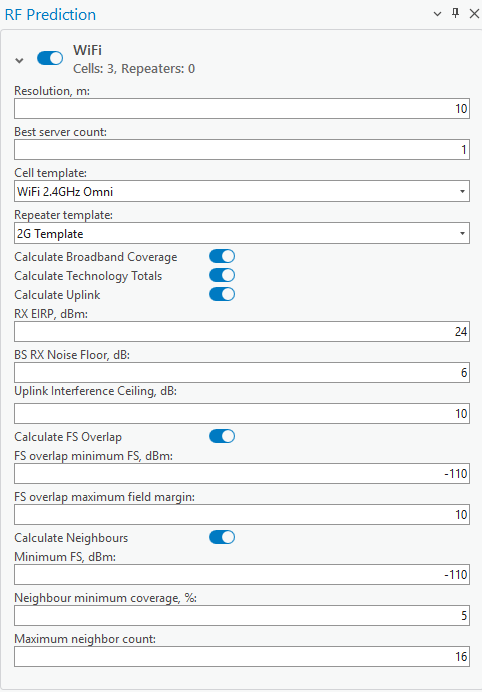

# WiFi

> **Applies to:** RCP.

Cells are automatically divided into sections based on the technology attribute. Select cells on the map and click the RF Prediction button to open the RF Prediction dialog — based on the selection, the cells are divided into technologies (Narrowband 2G, Broadband 3G, Broadband 4G, Broadband 5G, WiFi).

| Common Parameter | Description |
|---|---|
| Calculation Name | The name of the calculation will be displayed in the [CE Calculation Task List](../../7-1-ce-calculation-task-list.md). |
| Open raster after completion | Displays the prediction visualization (raster) after successful prediction calculation. |
| Recalculate Objection Position | Reviews the current X/Y and Longitude/Latitude values in the selected Cells table, and corrects them if these values differ from the object's geometry. |
| Calculate 3D | Runs calculations at different receiver heights and, after completion, creates a single Voxel file to visualize Field Strength values in a 3D scene. |
| Run | Starts the prediction calculation. |

## WiFi Parameters

| Parameter | Description |
|---|---|
| Resolution | Resolution for raster calculations. The output rasters will be produced with the indicated cell size. |
| Best server count | Option to calculate up to 5 best servers. The prediction rasters show the 1st, 2nd, 3rd, and so on strongest signal sources. |
| Cell template | Option to use the parameters from the template if the cell misses the required parameters. |
| Calculate Broadband Coverage | Calculates RSSI, RSRQ, RS-SINR, and DL Throughput. |
| Calculate Technology Totals | Merges all technologies that share the same Field Strength. The result is a separate group of rasters. |
| Calculate uplink | Calculates the Uplink Signal Throughput — the speed at which data is transferred, measured in Mb/s. |
| RX EIRP | The EIRP value of the receiver, in dBm. |
| BS RX Noise Floor | Best Server receiver's lowest noise level. No values below this level are included in the calculation. |
| Uplink Interference Ceiling | Uplink's highest interference value. No values above this point are included in the calculation. |
| Calculate FS Overlap | Calculates the geographical areas where two different cells provide similar signal strength — see below. |
| Calculate Neighbours | Enables cell neighbour matrix calculation. |

### Calculate FS Overlap

This calculation identifies the geographical areas where two different cells provide similar signal strength. Specifically, it identifies regions where the absolute difference between the field strengths of Cell 1 and Cell 2 is less than a defined threshold (e.g. 10 dB). This analysis is useful for understanding coverage overlaps and potential handover zones between cells.

Field strength overlap can be calculated using:

- **Minimum FS threshold (dBm)** — defines the lowest acceptable field strength for overlap consideration.
- **Maximum field margin (dB)** — sets the tolerance range for overlap levels.

The output is a raster layer that displays the degree of overlap in dB ranges (e.g. `<3 dB`, `3–5 dB`, `5–7 dB`, `7–9 dB`, `>9 dB`). This enables planners to quickly identify areas of strong cell overlap, potential handover zones, or interference-prone regions.

### Calculate Neighbours

Neighbour relationships between cells are determined based on:

- **Minimum FS threshold (dBm)** — ensures neighbours are only counted if they meet a minimum signal level.
- **Neighbour minimum coverage (%)** — sets the minimum overlap percentage required for a cell to qualify as a neighbour.
- **Maximum neighbour count** — limits the number of neighbours assigned to each cell.

The results include a visual neighbour matrix showing connections between cells with coloured link lines. For each calculated cell:

- Frequency group (MHz)
- Covered area (km²)
- Neighbouring cells with:
  - Relation type (e.g. Intra-Frequency)
  - Overlap area (in km²)
  - Overlap percentage (%)

## Available Coverage Rasters

- Equivalent Reference Signal Receive Power (RSRP) raster in dBm, as measured for a reference OFDMA sub-carrier bandwidth. It is possible to calculate the rasters separately for the 1st, 2nd, 3rd, 4th, and 5th strongest signal levels, depending on the count defined in the Best server count option.
- The best server raster shows the identification of cells that generate the strongest signals at each pixel. Raster count depends on the Best server count parameter value specified by the user:
  - 1st best server shows the serving cell with the strongest field strength.
  - 2nd best server shows the second strongest field strength cell identification.
  - 3rd best server shows the third strongest field strength cell identification.
  - 4th best server shows the fourth strongest field strength cell identification.
  - 5th best server shows the fifth strongest field strength cell identification.
- RSSI raster in dBm.
