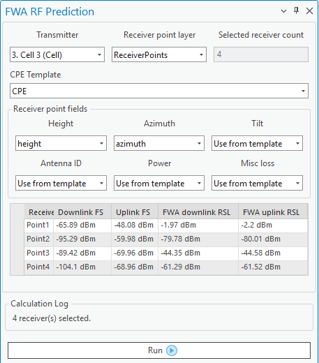

# FWA RF Prediction

> **Applies to:** RCP.

The FWA RF Prediction tool enables batch radio profile calculations to quickly estimate link performance from a single transmitter to multiple CPEs or to a set of selected receiver points. For each receiver point, the tool computes and displays Downlink FS, Uplink FS, FWA Downlink RSL, and FWA Uplink RSL. These outputs enable a quick assessment of link viability and quality at each location. Results for each receiver point are listed in a structured table, allowing comparison of link performance across multiple points.

Click the FWA RF Prediction button to open the dialog.

This tool is designed for rapid evaluation of coverage quality for potential customer sites in FWA networks, as well as batch link feasibility checks for network planning and rollout, validation of antenna placement and orientation impacts on service availability, and comparative performance analysis across multiple CPE configurations.

One transmitter can be selected at a time, and the receiver point layer can either be a point feature layer added to the map or CPE network objects. If no receiver points are selected on the map, all points are used for calculations. A CPE template can be used to fill in missing values from the receiver point layer. Furthermore, receiver point fields can be mapped from the receiver point attributes, or alternatively, used from the CPE template.

Once all fields are selected, press **Run** to perform the calculations. The result is a table showing Downlink/Uplink FS, and FWA downlink/uplink RSL values for each receiver point.
