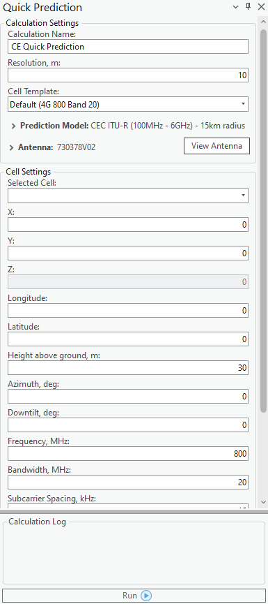

# Quick Prediction

> **Applies to:** RCP.

Click the Quick Prediction button to open the dialog. Quick Prediction is a tool that lets you select a point on the map and make a prediction without the need to create a cell. The selected point is represented as a brown dot on the map. Quick Prediction also lets you select a cell as the point, meaning that you can also make quick predictions with the created cells.

When the Quick Prediction button is pressed, a map tool is activated which lets you select a point on the map. Upon selecting this point and pressing the **Calculate** button, a visual representation of the calculation is rendered on the map, and the relevant data is presented in the [CE Calculation Task List](../7-1-ce-calculation-task-list.md).

## Quick Prediction Parameters

| Parameter | Description |
|---|---|
| Calculation Name | Name of the calculation that will be displayed in the CE Calculation Task List. |
| Resolution | Resolution for raster calculations. The output rasters will be produced with the indicated cell size. |
| Cell Template | The Cell Template used in the prediction calculations. |
| Prediction Model | The prediction model used in the prediction calculations. |
| Antenna | The antenna used in the prediction calculations. |
| Selected Cell (Optional) | A cell from which the calculation will be done. |
| X | Coordinate in the projected coordinate system. |
| Y | Coordinate in the projected coordinate system. |
| Z | Coordinate in the projected coordinate system. |
| Latitude | Decimal degrees Y type coordinate in the WGS 1984 geographical coordinate system. |
| Longitude | Decimal degrees X type coordinate in the WGS 1984 geographical coordinate system. |
| Height above ground | Cell height above the ground, in meters. |
| Azimuth | Cell direction from North, in degrees. |
| Downtilt | The cell's vertical angle offset. |
| Frequency | The frequency value in MHz. |
| Bandwidth | Value in MHz. Required for 4G and 5G technologies; for other technologies, define the value as `0.015`. |
| Subcarrier spacing | Value in kHz. Required for 4G and 5G technologies; for other technologies, define the value as `15`. |
| Tx MIMO | Transmitter antenna count. Available values: 1, 2, 4, 8, 16, 32, 64. |
| Rx MIMO | Receiver antenna count. Available values: 1, 2, 4, 8, 16, 32, 64. |

**Results:**

- Field Strength raster in dBm.
