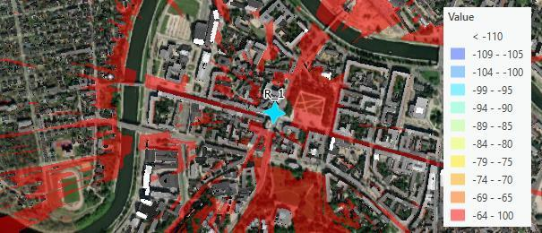

# Radar Prediction

> **Applies to:** RCP.

Click the Radar Prediction button to open the dialog. Radar Prediction is a tool that lets you calculate predictions on radars. Depending on the view angle and the size of the radar, Radar Predictions show the reach of radar signals. Radar signals may differ on various objects: drones, planes, etc. For example, drones are identified within a smaller distance than planes.

## Radar Prediction Parameters

| Parameter | Description |
|---|---|
| Calculation name | The calculation identification. |
| Resolution | The cell size, in meters. |
| Best Server count | Option to calculate up to 5 best servers. |
| Radar template | Template used to calculate the radar predictions. |
| Target cross-section | The radar size. |
| Selected | Current number of selected radars. |
| Run Calculation | Runs the radar prediction calculations. |

## Results

- Field Strength raster in dBm.
