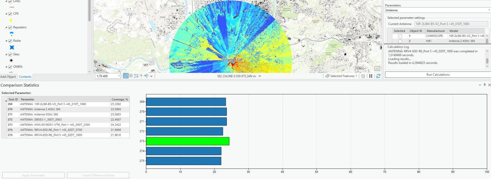

# Compare Predictions

> **Applies to:** RCP.

Compare Predictions is a tool that lets you compare the results of RF predictions with different parameters. There are 4 possible parameters to choose from: Antenna, Azimuth, Tilt, and Height. When a different parameter is selected, the selected parameter settings dialog also changes. This tool is extremely useful if the user wants to quickly check which parameter creates the best possible prediction coverage.

Click the Compare Predictions button to open the dialog.

| Parameter | Description |
|---|---|
| Selected Cell | The cell on which the predictions will be performed. |
| Cell Templates | Cell Templates that will be used in the prediction calculations. |
| Resolution | Cell size, in meters. |
| Parameters | A list of 4 parameters: Antenna, Azimuth, Tilt, and Height. Select one of the parameters to execute the predictions. |
| Current Parameter | The parameter that is currently present in the cell. |
| Minimal Signal Strength | Signal strength is the floor of the predictions. No signal lower than this value is included in the calculations. |
| From | The starting value of the parameter for calculations. |
| To | The destination value of the parameter for calculations. |
| Step | The increment by which the starting point reaches the destination. |
| Run Calculation | Starts the prediction calculation. |

If the user selects one of the results from the results table, that result is highlighted in the bar chart as well as the corresponding prediction layer on the map.

Compare Predictions also provides the possibility to create a **Difference Raster** — a raster made from two RF Prediction rasters that shows the value differences between them. If the user wants to apply the parameter that produces the biggest coverage value, they can select one of the results from the result table and press **Apply Parameters**.

| Button | Description |
|---|---|
| Apply Parameters | Applies the selected parameter to the currently selected cell. |
| Create Difference Raster | Creates a raster made from two RF Prediction rasters. It shows the value differences between them. |
