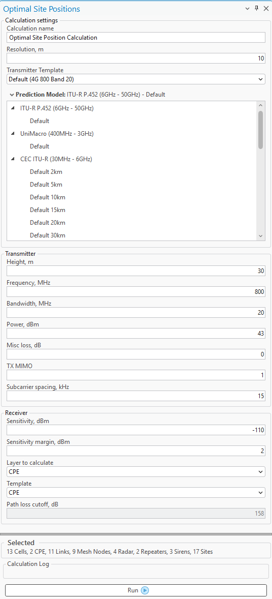
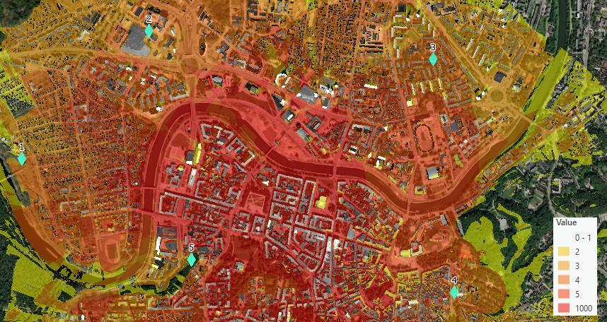

# Optimal Site Positions

> **Applies to:** RCP.

Optimal Site Positions is a tool that lets the user find optimal positions for a site based on specified parameters. The prediction produces two rasters:

- **Covered Points** — defines the number of points covered in a certain pixel.
- **Coverage Percentage** — the percentage by which the pixel is covered, meaning that 100% is a fully covered point.

Click the Optimal Site Positions button to open the dialog.

| Parameter | Description |
|---|---|
| Calculation Name | The name of the current calculation. |
| Resolution | Cell size, in meters. |
| Transmitter Template | The template that will be used to fill transmitter parameters. |
| Selected Model | The prediction model list. |
| Transmitter height | The height of the tower that hosts the site. |
| Frequency | The frequency value in MHz. |
| Power | Transmitter power in dBm. |
| Bandwidth | Bandwidth of the transmitter, in MHz. |
| Misc loss | Misc loss of the transmitter, in dB. |
| Tx Mimo | Transmitter antenna count. Available values: 1, 2, 4, 8, 16, 32, 64, 128, 256, 512, 1024. |
| Subcarrier spacing | Value in kHz. |
| Sensitivity | Receiver sensitivity in dBm. |
| Layer to calculate | The type of network objects to use for optimal site position calculations. |
| Template | The template that will be used to fill receiver parameters. |
| Path loss cutoff | The path loss is the floor of the prediction. No path loss lower than this value is included in the calculations. |
| Run Calculation | Starts the prediction calculation. |

**Results:**

- Covered Points.
- Coverage Percentage.
