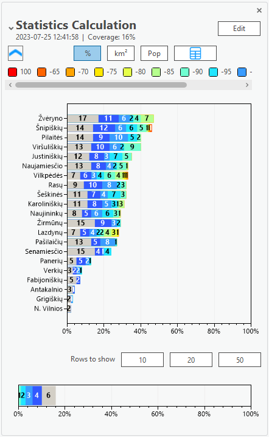
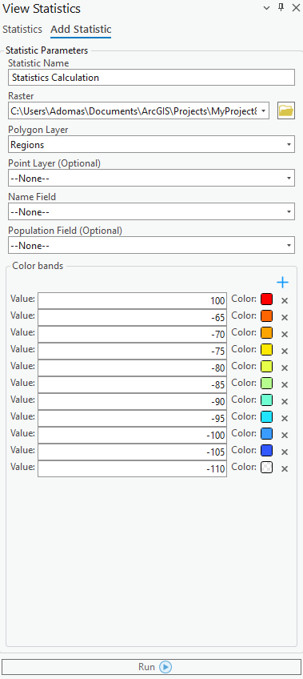

# View Statistics

> **Applies to:** RCP.

View Statistics is a tool that calculates the total coverage of a polygon based on its overall coverage (signal strength, DL throughput, etc.). The resulting statistics include the total coverage and individual coverage of each polygon segment.

Click the View Statistics button to open the dialog. To add statistics, press the **Add Statistics** tab on the dockpane.

## Statistics

When the calculation is complete, you are redirected to the Statistics window, where you can view the calculation results. The immediate expander of the calculation shows the overall coverage (in percentages) of all the polygon regions.

By opening the expander, you can examine the specific regions, their population, and area coverages. You can also change the colors of the color bands by clicking the squares near the region values.

| Control | Description |
|---|---|
| Table button | View the details about the polygon areas and calculated data in a table. Also export the table data in CSV format. |
| Edit button | Edit the selected statistic. |
| Exit Edit Mode | Exits edit mode and cancels all changes. |

## Add Statistics

### Add Statistic Parameters

| Parameter | Description |
|---|---|
| Statistic Name | The name of the Statistic. |
| Raster | The raster layer of one of the coverage results. |
| Polygon Layer | The polygon layer for which the coverage will be calculated. |
| Point Layer (Optional) | Used to specify the calculation. |
| Name Field | Defines the names of territories that will be displayed in the results. |
| Population Field (Optional) | Establishes the population field that will be used to calculate the total coverage of the population. |
| Color Bands | The color of each segment in the statistics. The color bands are automatically retrieved from the raster layer if it contains symbolization. |
| + | Adds a new color band. |
| × | Removes a color band. |
| Run | Runs the statistics calculation. |
