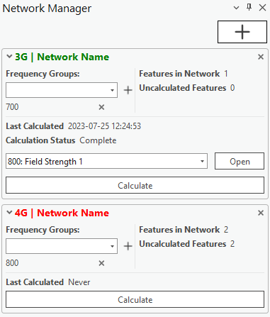

# Network Manager

> **Applies to:** RCP.

Network Manager is a tool that lets you group cells and repeaters into networks based on their frequency groups and technologies. In doing so, you can easily select particular networks and run RF Calculations on them without needing to select any particular network objects. The technologies are taken from the Cells table.

Network Manager tracks changes in the `technology` and `frequency_group` fields of the Cells and Repeaters tables. If the values of these fields change, Network Manager accommodates such changes by regrouping the changed parameters based on the new technologies and frequency groups.

When frequency groups are modified, removed, added, or affected in any other way, the frequency group titles change color from green to red. While the RF calculation is processing, the title color changes to yellow. When the RF calculation is completed on that frequency group, the current network configuration is saved, and the title color changes back to green.

Click the Network Manager button to open the dialog. To create a network, press the **+** button on the dockpane.

## Add Network Parameters

| Parameter | Description |
|---|---|
| Name | The name of the network. |
| Technology | The technology that the network will be based on. All network objects will be filtered by it in the network. |
| Create Network | Adds the network to the network list. |

## Network Manager Parameters

| Parameter | Description |
|---|---|
| Frequency Groups | Frequency groups that share the same technology. |
| Last Calculated | The last time the calculation was started. |
| Calculation Status | Status of the current calculation. |
| Selected Frequency Groups | Frequency groups on which the RF Calculations will be completed. |
| Features in Network | Number of network objects present in the Selected Frequency Groups. |
| Uncalculated Features | Number of network objects that have not yet been added to an RF calculation. |

| Control | Description |
|---|---|
| + | Adds a frequency group to Selected Frequency Groups. |
| × (inside the network) | Removes a frequency group from Selected Frequency Groups. |
| × (in the network title) | Removes the network from the network list. |
| Calculate | Opens the RF calculation dialog with the selected network objects. |
