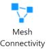
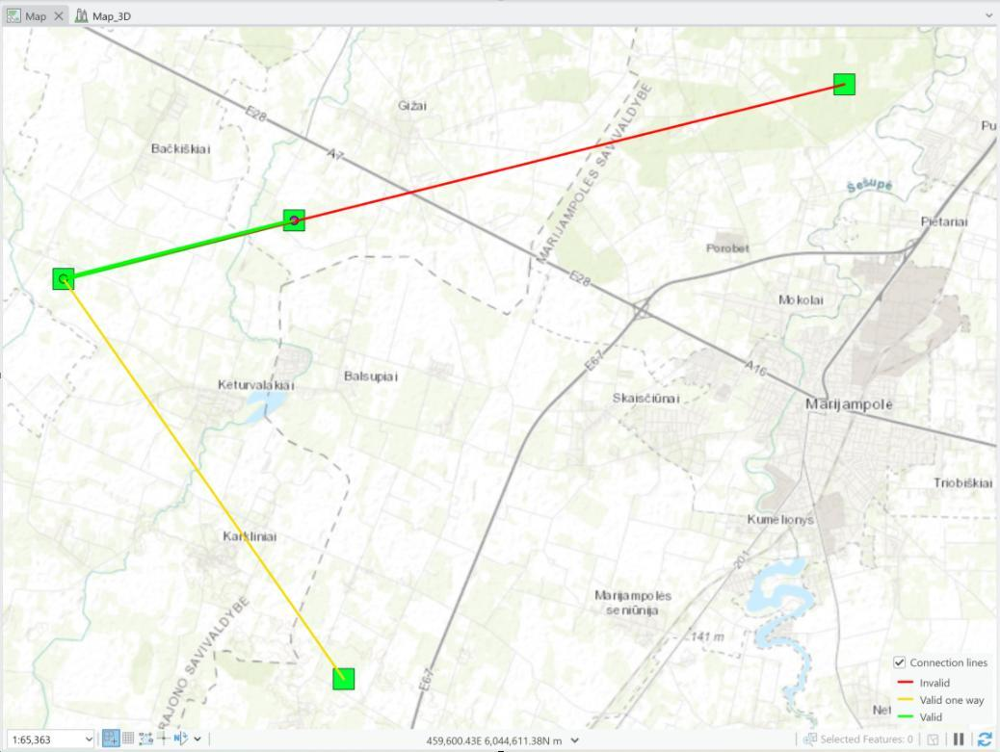
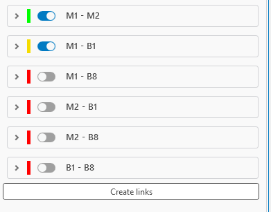

# Mesh Connectivity

> **Applies to:** RLP.

Click the Mesh Connectivity button to open the dialog. This tool enables rapid and accurate assessment of wireless peer-to-peer link quality during mesh network planning and optimization.

## How It Works

1. Select one or more Mesh Nodes in the workspace.
2. Open the Mesh Connectivity tool.
3. Define:
   - **Calculation name** — the calculation name, which will be visible in Contents.
   - **Mesh node template** — the mesh node template to use if selected features don't have all the necessary parameters.
   - **Mesh node feature class** — by default, Mesh Nodes are used for the calculations, but an external point-type feature class can be used to estimate connectivity between features.
4. Press **Run** to start the simulation.

The tool calculates the RSL between each node pair and compares it against the configured RSL sensitivity threshold defined for the Mesh Node object. Connectivity status is then visually rendered using a clear, color-coded scheme:

| Color | Status |
|---|---|
| Green | Bi-directional connectivity — both nodes meet or exceed the RSL sensitivity for each other. |
| Yellow | Uni-directional connectivity — only one node meets the RSL threshold for the other. |
| Red | No connectivity — RSL falls below the sensitivity threshold in both directions. |

## Results

**All combinations**
Shows all possible combinations of Mesh network connections.

**Connection lines**
Shows the Mesh connections for which the tool will create a Link object.

## Creating Links from Results

To create Links between Mesh Nodes, define the Mesh connectivity results. Once a result is selected, it adds the possible options for creating links between Mesh Nodes.

| Option | Description |
|---|---|
| Delete existing links | If selected, existing links that have been created from Mesh Connectivity results are deleted. |
| Create only enabled links | If checked, links are created only from the checked connectivity lines in the suggested list. |
| Enable/Disable (per link) | Toggles individual links from the suggested list on or off. |

Once parameters are set, press **Create links** to create Links between Mesh objects.
