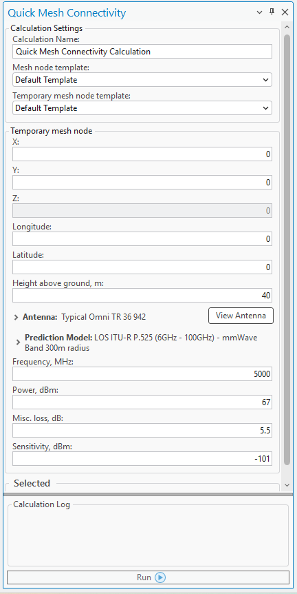
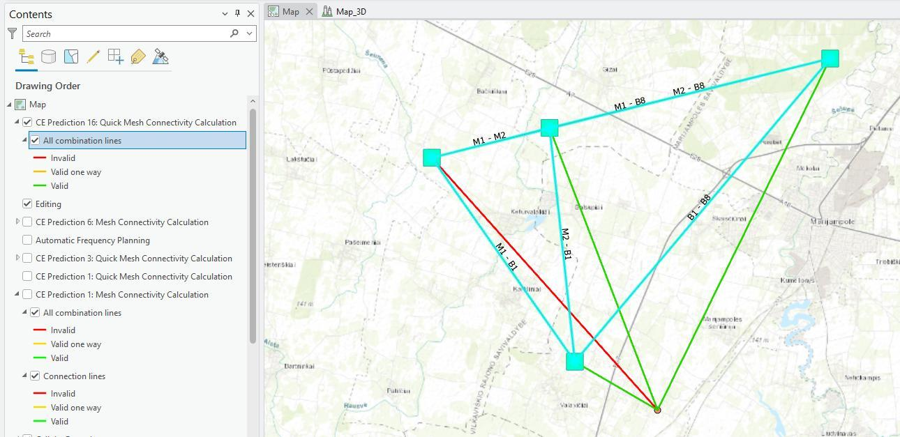

# Quick Mesh Connectivity

> **Applies to:** RLP.

Click the Quick Mesh Connectivity button to open the dialog. To enhance the efficiency of early-stage planning and dynamic mesh layout, the Quick Mesh Connectivity tool offers a fast and intuitive way to assess connectivity potential.

This lightweight yet powerful feature enables users to instantly evaluate whether a Mesh Node can connect to an existing mesh network based on either its current position or a proposed location. Whether you are planning the deployment of a single node or simulating a mobile mesh scenario, Quick Mesh Connectivity streamlines the decision-making process by providing immediate, actionable feedback.

## Workflow

1. **Select Existing Mesh Nodes** — on the map interface, select the Mesh Nodes that should be included in the connectivity calculation.
2. **Open the Quick Mesh Connectivity Tool** — launch the tool from the menu or toolbar.
3. **Define the Proposed Node Location** — choose the location of the new Mesh Node either by clicking directly on the map or by entering specific coordinates.
4. **Configure Node Parameters** — input the required parameters for the proposed Mesh Node (e.g. transmission power, antenna type, height).
5. **Run the Calculation** — click **Run** to initiate the connectivity analysis.
6. **View the Results** — once the analysis is complete, the results appear in the Contents panel and on the map:
   - Green indicates areas with successful two-way connectivity.
   - Yellow shows one-way connectivity.
   - Red marks areas with no connectivity.

## Parameters

| Parameter | Description |
|---|---|
| Calculation Name | The name of the calculation, which will be used and loaded to Contents. |
| Mesh node template | The Mesh Node Object Template, automatically used whenever a Mesh object lacks the required parameters needed to complete connectivity calculations — ensuring all essential data is available for accurate simulation and evaluation, even if the original Mesh object is incomplete. |
| Temporary mesh node template | The Temporary Mesh Node Object Template, automatically used whenever a newly proposed Mesh object lacks the required parameters needed to complete connectivity calculations — ensuring all essential data is available for accurate simulation and evaluation, even if the original Mesh object is incomplete. |
| Latitude | Decimal degrees Y type coordinate in the WGS 1984 geographical coordinate system. |
| Longitude | Decimal degrees X type coordinate in the WGS 1984 geographical coordinate system. |
| X | Coordinate in the projected coordinate system. |
| Y | Coordinate in the projected coordinate system. |
| Z | 3D dimensions representing an object's height above sea level, used for visualizing objects in a 3D scene. |
| Height Above Ground | Mesh node object's height above the terrain. |
| Antenna | Antenna used for the Mesh Node. |
| Prediction model | Prediction model used to calculate the path loss between Mesh Nodes. |
| Frequency | Frequency in MHz for the proposed Mesh Node. |
| Power | Tx power in dBm for the proposed Mesh Node. |
| Misc. Loss | Total losses in dB for the proposed Mesh Node. |
| Sensitivity | Receiving Signal Level threshold in dBm at the Mesh Node. |
