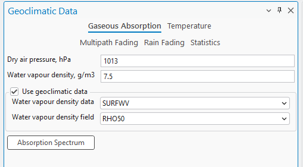
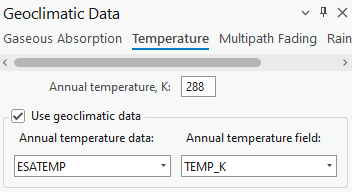
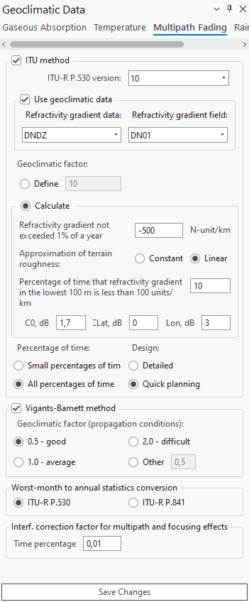
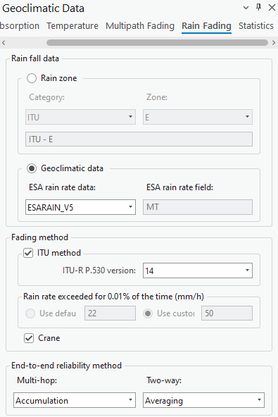
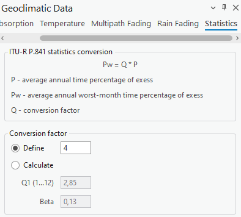

# Geoclimatic Data

> **Applies to:** RLP.

Click the Geoclimatic Data button to open the dialog. Geoclimatic Data is a tool that lets you adjust the geoclimatic settings used in certain calculations (e.g. [Link Prediction](9-2-2-link-prediction.md)).

## Gaseous Absorption

Gaseous absorption pages define values for dry air pressure and water vapour density. These values can be obtained from predefined geoclimatic data maps. Water vapour density data is per ITU-R P.836-3, and is used in gaseous absorption evaluation.



| Parameter | Description |
|---|---|
| Dry Air Pressure | The atmospheric pressure contributed by air that contains no water vapor, typically measured in hectopascals (hPa). |
| Water Vapour Density | The mass of water vapor present in a unit volume of air, typically measured in grams per cubic meter (g/m³). |
| Water Vapour Density Data | A dropdown menu that lets you select the source or type of data used to determine water vapor density. |
| Water Vapour Density Field | A dropdown menu to select the specific field or parameter from the chosen data source that provides the water vapor density information. |
| Use Geoclimatic Data | Enable/disable this geoclimatic data. |
| Absorption Spectrum | A button that lets you see the visual representation of the absorption spectrum. |

### Absorption Spectrum Plot Settings

| Parameter | Description |
|---|---|
| Linear/Logarithmic | Specifies how the axes values are calculated and displayed on the plot. Logarithmic is calculated as log₁₀. |
| Frequency From/To | The frequency range of the absorption spectrum. |
| Path Length | The length of the spectrum. |

## Temperature

Annual mean surface temperature at 2 m above the surface of the Earth, per ITU-R P.1510. The data is used to evaluate the thermal noise of a receiver.



| Parameter | Description |
|---|---|
| Annual Temperature | Annual temperature, expressed in Kelvins. |
| Annual Temperature Data | A dropdown menu allowing you to select the dataset from which the annual temperature data should be sourced. |
| Annual Temperature Field | A dropdown menu to select the specific data field within the chosen dataset that contains the annual temperature information. |
| Use Geoclimatic Data | Enable/disable this geoclimatic data. |

## Multipath Fading

The Multipath Fading page defines refractivity data and calculation parameters for the ITU and Vigants-Barnett methods. Worst-month-to-annual statistics conversion can be performed according to the ITU-R P.530 or ITU-R P.841 methods. Refractivity gradient data is based on ITU-R P.453-9, and is used for multipath fading analysis.



| Parameter | Description |
|---|---|
| ITU Method | Enable/disable the ITU method. |
| ITU-R P.530 version | A checkbox indicating the use of the ITU's method for calculations, with a dropdown to select the ITU-R P.530 version. |
| Use Geoclimatic Data | Enable/disable this geoclimatic data. |
| Refractivity Gradient Data | Refractivity gradient data: `DNDZ`. |
| Refractivity Gradient Field | Refractivity gradient field: `DN01`, `DN10`, `DN50`, `DN90`, `DN99`, `KF01`...`KF99`. |

- **DNx** — refractivity gradient not exceeded for x% of the average year in the lowest 65 m of atmosphere. `DN01` is the parameter referred to as dN1 in ITU-R P.530.
- **KFx** — effective Earth radius not exceeded for x% of the average year in the lowest 65 m of atmosphere. `KFx` is provided only for map preview and cannot be used in the Geoclimatic Data settings dialog.

| Parameter | Description |
|---|---|
| Geoclimatic Factor (Define) | A field to input or calculate a factor used in propagation modeling, affecting the prediction of multipath fading. |
| Geoclimatic Factor (Calculate) | Calculates the geoclimatic factor used in propagation modeling, affecting the prediction of multipath fading:<br>• **Approximation of terrain roughness** — how terrain roughness is modeled in the calculations, as a constant value or as a linear approximation.<br>• **Percentage of time that refractivity gradient in the lowest 100 m is less than 100 units/km** — the percentage of time when the refractivity gradient at low altitudes meets a specific threshold.<br>• **Co, dB / Lat, dB / Lon, dB** — correction values in decibels for specific geographic coordinates, related to the orientation or position of the transmitter/receiver. |
| Percentage of Time / Design | Radio buttons to choose the granularity of the time percentage for which the calculations are relevant, and the level of detail required for planning. |
| Use Vigants-Barnett Method | Enable/disable the Vigants-Barnett method. |
| Geoclimatic Factor (Propagation Conditions) | A checkbox to select this specific method for calculations, with radio buttons to choose a geoclimatic factor indicating propagation conditions. |
| Worst-month-to-annual statistics conversion | Select the ITU recommendation (ITU-R P.530 or ITU-R P.841) for converting worst-month statistics to annual statistics. |
| Interf. correction factor for multipath and focusing effects | The percentage of time to apply an interference correction factor to account for multipath and focusing effects. |

## Rain Fading

The Rain Fading page defines rain regions (ITU and Crane) for rain rate statistics and calculation methods (ITU and Crane). The rain rate exceedance parameter for 0.01% of the time can be set manually or automatically according to the rain zone. Rain rate data is based on ITU-R P.837-4, and is used to evaluate rain fading.



| Parameter | Description |
|---|---|
| Rain Zone | Categorizes the geographic location by ITU rain zone standards, used to estimate rain attenuation in different regions. |
| Geoclimatic data — ESA rain rate data / ESA rain rate | Select the dataset (e.g. `ESARAIN_V5`) and the specific field within that dataset (e.g. `MT`) for rain rate data, used to calculate rain attenuation. |
| Fading method — ITU method / ITU-R P.530 version | A checkbox to select the ITU method for rain fading calculations, and a dropdown to choose the version of the ITU-R P.530 recommendation being applied. |
| Rain rate exceeded for 0.01% of the time (mm/h) | Use either default or custom values for the rain rate exceeded for 0.01% of the time, a measure used to predict rain fading. |
| Crane | Selects the Crane model for calculating rain attenuation. |
| End-to-end reliability method — Multi-hop / Two-way | Selects the method for calculating the reliability of a signal in a communication path that may involve multiple hops or two-way transmission. |

## Statistics

These settings handle statistical conversions for telecommunication planning, ensuring systems are designed to cope with worst-case scenarios based on historical data and predictive models.



The ITU-R P.841 statistics conversion formula is:

```
Pw = Q * P
```

Where:

- **P** — average annual time percentage of exceedance.
- **Pw** — average annual worst-month time percentage of exceedance.
- **Q** — conversion factor.

| Parameter | Description |
|---|---|
| Conversion factor — Define / Calculate | Either define a fixed conversion factor, or calculate it based on additional inputs. |
| Q1 (1...12) | An input field used to define a conversion factor or another parameter for a specific month or set of months. |
| Beta | The beta parameter, part of the statistical model or conversion formula within the ITU-R P.841 recommendation. |

Press **Save Changes** to save changes to the settings.
