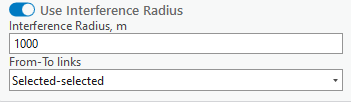
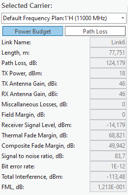
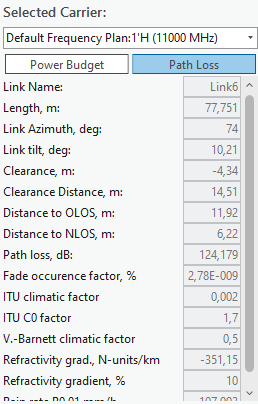
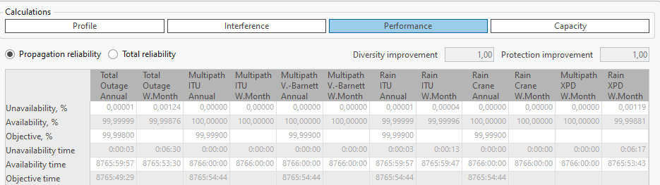
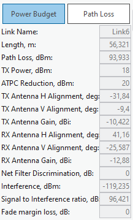
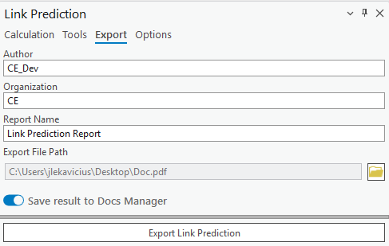
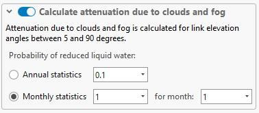
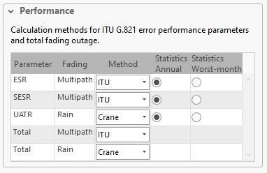

# Link Prediction

> **Applies to:** RLP.

Click the Link Prediction button to open the dialog. Link Prediction is a tool specific to the CE for ArcGIS Pro RLP license. The tool enables you to calculate Link predictions.

## Calculation

The Calculation tab is found on the Link Prediction dockpane. Here you can see the selected number of carriers as well as some other parameters.

| Parameter | Description |
|---|---|
| Calculation Name | Link Prediction identification. |
| Link Template | Fills all empty or unspecified fields with default values that are not necessary for predictions. |
| Calculate Interference | If checked, calculates the interference of multiple links. If enabled, also allows specifying a certain radius from either link endpoint — points outside this range are not included in the calculation, speeding up the calculation process. If the radius is not specified, all links are used in the calculations. |

The **From-To links** dropdown setting allows the selection of links used for interference calculations. The available options are **Selected-selected** (default), **Selected-all**, and **All-all**. When **All-all** is selected, it is not necessary to manually select all links on the map to perform the prediction calculations.

### Links

After calculations, a new dockpane opens. In the **Links** tab, you can view Power Budget, Path Loss, Interference, and Performance calculation results.

The Link Profile behaves in virtually the same way as a regular profile (you cannot adjust Link Profile data) — see [Profile](../../6-profile.md).

**Power Budget and Path Loss**

This section of the results contains Power Budget and Path Loss results. Select different carriers to view the results for each one of them.

- **Power Budget** — the calculation of the balance between transmitted power, power losses in the system, and receiver sensitivity in a communication system.
- **Path Loss** — the reduction in signal strength as it travels from the transmitter to the receiver.

| Power Budget field | Description |
|---|---|
| Link Name | The link identification. |
| Length, m | The link's length. |
| Path Loss, dB | The calculated path loss. |
| TX Power, dBm | Transmitter power. |
| TX Antenna Gain, dBi | Transmitter antenna gain. |
| RX Antenna Gain, dBi | Receiver antenna gain. |
| Miscellaneous Losses, dB | Miscellaneous losses. |
| Field Margin, dB | The field margin. |
| Receiver Signal Level, dBm | The signal level at the receiver. |
| Thermal Fade Margin, dB | The thermal fade margin. |
| Composite Fade Margin, dB | The composite fade margin. |
| Signal to noise ratio, dB | The signal-to-noise ratio. |
| Bit error rate | The bit error rate. |
| Total Interference, dBm | Total interference level. |
| FML, dB | Fade margin loss. |

| Path Loss field | Description |
|---|---|
| Link Name | The link identification. |
| Length, m | The link's length. |
| Link Azimuth, deg | The link's azimuth. |
| Link tilt, deg | The link's tilt. |
| Clearance, m | The path clearance. |
| Clearance Distance, m | The distance at which clearance is measured. |
| Distance to OLOS, m | Distance to the OLOS obstruction. |
| Distance to NLOS, m | Distance to the NLOS obstruction. |
| Path loss, dB | The calculated path loss. |
| Fade occurrence factor, % | The fade occurrence factor. |
| ITU climatic factor | The ITU climatic factor. |
| ITU C0 factor | The ITU C0 factor. |
| V.-Barnett climatic factor | The Vigants-Barnett climatic factor. |
| Refractivity gradient, N-units/km | The refractivity gradient. |
| Refractivity gradient, % | The refractivity gradient, as a percentage. |
| Rain rate P0.01 | Rain rate exceeded for 0.01% of the time. |

**Profile Plot, Interference, and Performance**

This section of the results contains the Profile Plot, Interference, and Performance results. Select different carriers to view the results for each one of them.

- **Interference** — the undesired impact of one signal on another, leading to potential signal degradation.
- **Performance** — assessments of key metrics like data rate, error rates, and signal-to-noise ratio, crucial for evaluating and optimizing a communication system's efficiency.

Select different links to see these results for them.

The Performance results table reports Unavailability %, Availability %, Objective %, Unavailability time, Availability time, and Objective time, broken down by Total Outage, Multipath ITU, Multipath V.-Barnett, Rain ITU, Rain Crane, and Multipath XPD — each for both the Annual and Worst-Month statistics. **Diversity improvement** and **Protection improvement** factors are also shown, and results can be viewed for **Propagation reliability** or **Total reliability**.

### Interfering Links

Navigate to the **Interfering Links** tab on the Link Prediction result dockpane. In this tab, you can view interference Power Budget, Path Loss, Profile, and Spectrum Mask results.

**Power Budget and Path Loss**

In this section, you can view Power Budget and Path Loss results. Change the selected site pair to see different results for each one of them.

- **Power Budget** — the calculation of the balance between transmitted power, power losses in the system, and receiver sensitivity in a communication system.
- **Path Loss** — the reduction in signal strength as it travels from the transmitter to the receiver.

| Field | Description |
|---|---|
| Link Name | The link identification. |
| Length, m | The link's length. |
| Path Loss, dBm | The calculated path loss. |
| TX Power, dBm | Transmitter power. |
| ATPC Reduction, dBm | The Automatic Transmit Power Control reduction. |
| TX Antenna H Alignment, deg | Transmitter antenna horizontal alignment. |
| TX Antenna V Alignment, deg | Transmitter antenna vertical alignment. |
| TX Antenna Gain, dBi | Transmitter antenna gain. |
| RX Antenna H Alignment, deg | Receiver antenna horizontal alignment. |
| RX Antenna V Alignment, deg | Receiver antenna vertical alignment. |
| RX Antenna Gain, dBi | Receiver antenna gain. |
| Net Filter Discrimination | Net filter discrimination value. |
| Interference, dBm | The calculated interference level. |
| Signal to Interference ratio, dB | The signal-to-interference ratio. |
| Fade margin loss | The fade margin loss. |

**Profile Plot and Spectrum Mask**

In this section, you can view Profile Plot and Spectrum Mask results. Change the selected site pair to see different results for each one of them.

- **Spectrum Mask** — the method used to assess the usage efficiency of a frequency spectrum in a telecommunications system, involving the measurement of how much and how effectively different frequencies are being utilized.

**Tx, Rx, Common** — remove/add the corresponding parameters from the plot.

## Reflections

Reflections are calculated in the same way as a regular Profile — see [Tools](../../6-profile.md#tools).

## Export (Link Prediction Report)

The calculation results can be automatically transferred into a Link Prediction Report. This report shows the profile, prediction parameters and results, performance, and propagation reliability. The report can be exported in PDF format.

> **Note:** The Link Prediction Report can also be saved to [Docs Manager](../../4-workspace/4-1-workspace.md#docs-manager) by enabling **Save result to Docs Manager**.

## Options

The Options tab is found on the Link Prediction dockpane. Here you can see additional parameters that can be changed in accordance with your prediction needs.

| Parameter | Description |
|---|---|
| Include Field Margin in Power Budget | If checked, takes the specified field margin into account for Power Budget calculations. |
| Field Margin | Extra signal strength beyond the minimum required, providing a buffer for reliable communication against unforeseen signal losses or variations. |
| Thermal Fade Margin Prediction | The threshold below which thermal fade will not be calculated. |
| Calculate attenuation due to clouds and fog | Enable/disable this option. |

> **Note:** Attenuation due to clouds and fog is calculated for link elevation angles between 5 and 90 degrees.

| Parameter | Description |
|---|---|
| Annual Statistics | The annual chance of reduced water, in %. |
| Monthly Statistics | The monthly chance of reduced water, in %. |
| For Month | Specifies which month the monthly statistic applies to. |
| Calculate Tropospheric Scatter | Enable/disable this option. |
| Time Percentage | Time percentage, in %. |
| No Interference Link Below Power | The power threshold below which no interference for links is calculated. |
| Exclude Interference Links from Analysis Below Power | The power threshold below which links with lesser interference are excluded from the analysis. |
| Tx/Rx Filter Discrimination | The ability of filters in a duplex system to effectively separate and prevent interference between Tx and Rx frequencies. No dBm greater than this value is accounted for in the calculation. |

### Performance Parameters

| Column | Description |
|---|---|
| Parameter | The specific telecommunication performance metric being evaluated. |
| Fading | The type of signal disruption being accounted for in the metric. |
| Method | The standard used to calculate the performance metric. |
| Statistics Annual | Indicates whether the metric is calculated based on yearly data. |
| Statistics Worst-month | Indicates whether the metric is calculated based on the data from the month with the poorest performance. |
