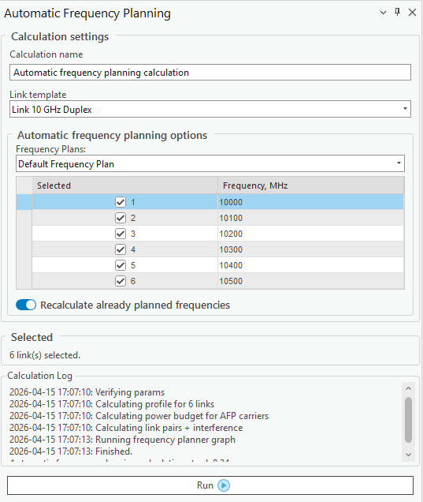

# Automatic Frequency Planning

> **Applies to:** RLP.

Click the Automatic Frequency Planning button to open the tool. The tool suggests the best channel for each selected link based on the chosen frequency plan and channel list. It accounts for inter-link interference, evaluates the signal-to-interference ratio (SIR) across available carriers, and aims to maximize link performance while minimizing co-channel interference.

The tool accounts for duplex link pairing, node-layer priority, and site location constraints (e.g. neighboring links and links sharing the same site). If automatic frequency planning is done with links created from Mesh Nodes, the tool avoids polarization conflicts by switching between horizontal and vertical polarizations for neighboring links sharing the same channel.

| Parameter | Description |
|---|---|
| Calculation name | Name of the calculation. |
| Link template | The template used for the calculation. |
| Frequency Plans | The [frequency plan](../../5-data-management/5-13-rlp/5-13-3-frequency-plans.md) to use, and which carriers within it are selectable. |
| Recalculate already planned frequencies | If enabled, allows already-planned frequencies to be reconsidered and reassigned by the calculation. |
| Run | Starts the automatic frequency planning calculation. |

The planning results include the link names, carrier IDs, assigned frequencies, best available modulation, polarization, SIR score (in dB), and identifying color. The results are visualized on the map, as well as in the Automatic Frequency Planning Results table. The recommended carriers can be assigned to the links and later used in [Link Prediction](9-2-2-link-prediction.md) calculations.
