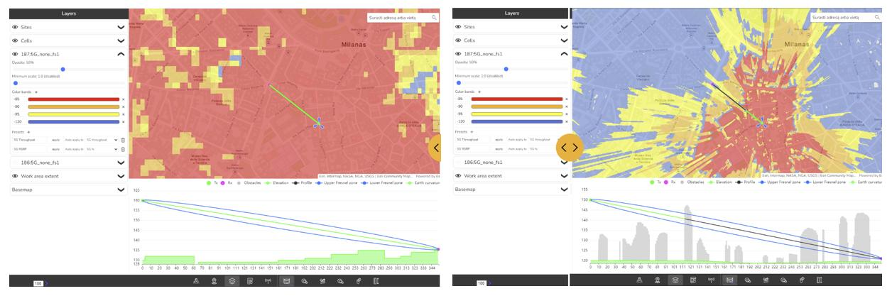
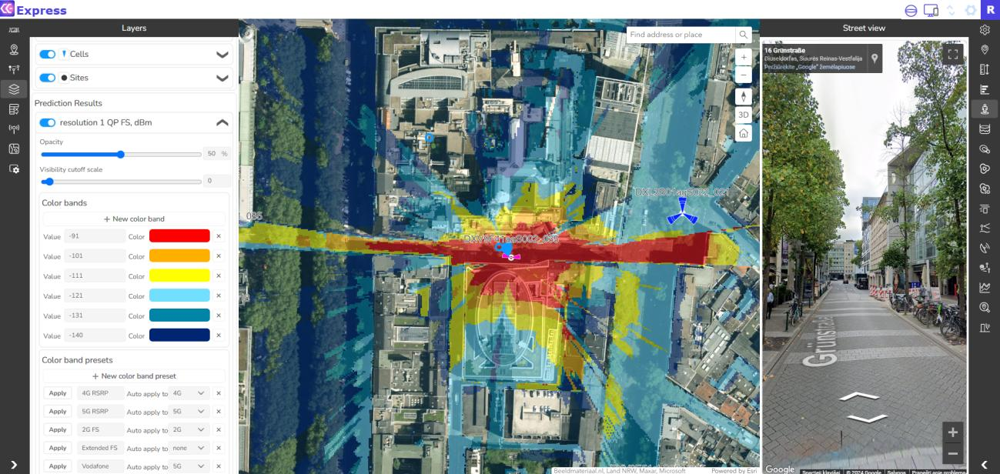
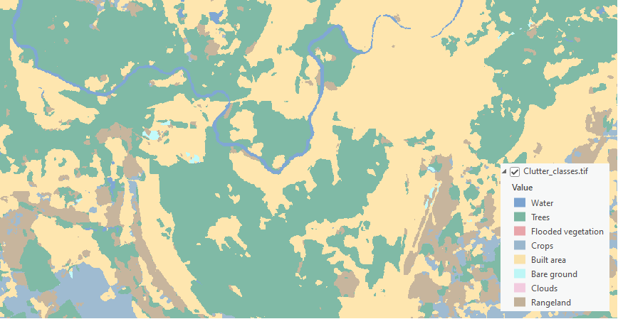
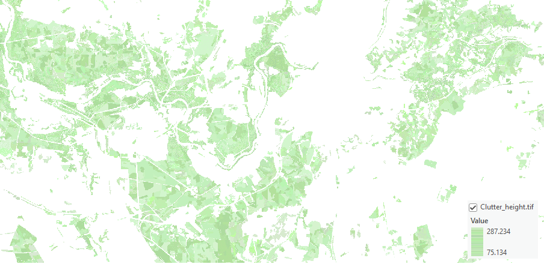
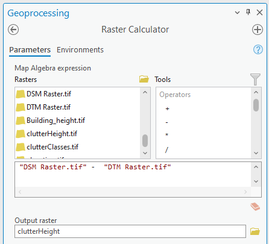

# Geodata Requirements 2025

> **Version:** CE Pro v4.9 / CE Express v7.2

Cellular Expert Technical Documentation
Table of Contents
1. High-Precision Inputs and Next-Generation Propagation 3
2. Geographic data requirements 5

## 2.1 Digital Terrain Model (DTM) Grid (Mandatory) 5

2.1.1 Projection 6
2.1.2 Correct No Data value and raster name 6
2.1.3 Pixel type 6

## 2.2 Clutter classes grid (optional) 7

2.2.1 Projection 8
2.2.2 Correct No Data value and raster name 8
2.2.3 Pixel type 8

## 2.3 Clutter heights (optional) 8

2.3.1 Projection 10
2.3.2 Correct No Data value and raster name 10
2.3.3 Pixel type 10
©Cellular Expert, 2025 Page | 2

---

Cellular Expert Technical Documentation
1. High-Precision Inputs and Next-Generation Propagation
CE Express is designed to work with any geospatial data available to the customer and fully exploit its
precision for the most accurate coverage and QoS calculations. The platform supports multi-resolution input
datasets — from freely available global sources such as Sentinel-2 10 m land cover and ASTER DEM, to
premium high-resolution terrain and 3D building [models](#kw:31-models:ce-express-tr-models) when provided by the customer or government
agencies.
Source: https://livingatlas.arcgis.com/landcoverexplorer/
By leveraging whatever data is available locally, CE Express performs nationwide calculations at the
maximum feasible resolution, accurately modeling signal propagation even in dense urban environments.
Support for 3D multi-height calculations ensures that coverage predictions reflect street-level, indoor, and

rooftop conditions, providing regulators with a realistic representation of service availability.
This flexibility ensures that customers can use their existing GIS assets, open datasets, or commercial data
they already license, turning them into actionable broadband maps without additional data procurement
requirements from the solution provider.
By using terrain elevation, obstacles, and [clutter](#kw:clutter-classification-values:ce-express-geodata) classification in every calculation, Cellular Expert
accurately [models](#kw:31-models:ce-express-tr-models):
- [Line-of-Sight](#kw:running-a-profile:ce-express-profile) and Non-[Line-of-Sight](#kw:running-a-profile:ce-express-profile) Conditions – Determining diffraction, reflection, and
shadowing effects over hills, valleys, and urban obstacles.
- Coverage Footprints – Generating precise signal strength maps at national, regional, and local
levels.
- Capacity and Interference Analysis – Modeling realistic signal overlaps and interference zones
for multi-operator, multi-technology environments.
©Cellular Expert, 2025 Page | 3

---

Cellular Expert Technical Documentation
Diffractio Free Space Loss
n
Diffractio
H
H [clutter](#kw:clutter-classification-values:ce-express-geodata) n obstacles
DSM
[Clutter](#kw:clutter-classification-values:ce-express-geodata) losses
UE
DTM
The CE tools make use of three distinct GIS data layers to obtain high precision modelling of radio wave
propagation losses:
- Digital Terrain Model (DTM), also known as Digital Elevation Model (DEM), which describes
Earth surface, i.e., path [terrain profile](#kw:reading-the-profile-graph:ce-express-profile) in terms of ground elevation above uniform sea level.
- Obstacles layer, delineating buildings and other such objects above Earth surface that may be
considered to be principal impediments for radio wave propagation.
- Clutter layer, delineating natural occurring or human cultivated ground cover that may be
partially penetrable by radio waves, such as natural vegetation (e.g., forests, trees, bushes) or
various crops, gardens, parks, etc.
The image above illustrates how Cellular Expert uses different resolutions of topographical data to
significantly improve coverage prediction accuracy.
- Left image: Coverage calculated using 25 m resolution ASTER DEM data, showing a general view
of signal distribution but with limited detail, especially in dense urban areas.
- Right image: Coverage calculated using 1 m resolution data, revealing a much more precise
propagation pattern, including building-level shadowing and accurate street-by-street coverage.
More information: https://blog.maxar.com/earth-intelligence/2022/benefits-of-using-maxars-precision3d-telco-suite-for-5g
Cellular Expert can easily integrate and process 1 m or even sub-meter topographical data, providing highly

detailed RF calculations. This level of precision is essential for:
- Modeling 2G/3G/4G/5G, small cells and [mmWave](#kw:56-step-8-losonly-prediction-for-mmwave:ce-express-tr-models) networks.
- Identifying exact coverage gaps at the building and street level.
©Cellular Expert, 2025 Page | 4

---

Cellular Expert Technical Documentation
- Supporting regulatory-grade broadband mapping and planning.
By using high-resolution terrain and clutter data, Cellular Expert ensures that its calculations match real-

world conditions as closely as possible — resulting in better network design decisions and more reliable
broadband planning outcomes.
2. Geographic data requirements
The supported geographical data types:
Only GeoTIFF is supported. Topographical data must have specific names:
- The Digital terrain model must be named elevation.tif
- The land use (or clutter) grid must be named clutterClasses.tif
- The clutter heights (typically building, vegetation height) grid must be named clutterHeight.tif
Mandatory geographical data:
- Digital Terrain Model (DTM) grid
All geodata must be located in one catalog.

## 2.1 Digital Terrain Model (DTM) Grid (Mandatory)

The Digital Terrain Model (DTM), also known as Digital Elevation Model (DEM), represents the Earth’s
ground level above sea level. Each raster pixel has its height value.
A sample DTM raster is presented below. Each pixel represents height value above the sea level. In reality,
within a one-pixel area, the height is not the same everywhere. Thus, the pixel’s height value is the height
©Cellular Expert, 2025 Page | 5

---

Cellular Expert Technical Documentation
in its center or the maximum. The smaller the pixels, the more accurate is the grid - but also more data to
calculate.
2.1.1 Projection
The raster must use a [Projected Coordinate](#kw:what-is-a-projected-[crs](#kw:check-crs:ce-express-geodata):ce-express-geodata) System. To check the coordinate system of your raster, use
the Properties function in ArcGIS Pro. Add the raster to your project, right-click on it, and select Properties.

Then, go to the Source tab > Spatial Reference and check the Coordinate System type parameter to confirm
it is in a [Projected Coordinate](#kw:what-is-a-projected-[crs](#kw:check-crs:ce-express-geodata):ce-express-geodata) System.
2.1.2 Correct No Data value and raster name
After setting the correct projection, assign the [NoData](#kw:check-and-set-nodata-value:ce-express-geodata): -9999 attribute and specify the appropriate name for
the DTM raster.
2.1.3 Pixel type
16-bit signed, or 32-bit signed or 32-bit float
©Cellular Expert, 2025 Page | 6

---

Cellular Expert Technical Documentation

## 2.2 Clutter classes grid (optional)

Land use or clutter refers to the classification of the earth’s surface into categories such as urban, suburban,
rural, forest, water, and open land, each of which affects radio propagation differently. Clutter data is crucial

because it determines how signals are absorbed, reflected, or diffracted by the environment, directly
influencing coverage, interference, and quality of service. The naming and classification of land use types
may vary. An example is the Sentinel-2 Land Cover dataset from the Living Atlas: Living Atlas Sentinel-2
Land Cover
©Cellular Expert, 2025 Page | 7

---

Cellular Expert Technical Documentation
2.2.1 Projection
The raster must use a [Projected Coordinate](#kw:what-is-a-projected-[crs](#kw:check-crs:ce-express-geodata):ce-express-geodata) System. To check the coordinate system of your raster, use
the Properties function in ArcGIS Pro. Add the raster to your project, right-click on it, and select Properties.

Then, go to the Source tab > Spatial Reference and check the Coordinate System type parameter to confirm
it is in a Projected Coordinate System.
2.2.2 Correct No Data value and raster name
After setting the correct projection, assign the [NoData](#kw:check-and-set-nodata-value:ce-express-geodata): -9999 attribute and specify the appropriate name for
the DTM raster.
2.2.3 Pixel type
16-bit signed, or 32-bit signed or 32-bit float

## 2.3 Clutter heights (optional)

Clutter heights represent the vertical dimension of obstacles such as buildings, trees, and other surface
features above the digital terrain model (DTM). While the DTM provides the bare-earth elevation, clutter
heights add the true 3D profile of the environment by capturing how high objects rise above the ground.
The clutter heights raster requires the accompanying clutterClasses.tif raster and cannot be used
independently.
©Cellular Expert, 2025 Page | 8

---

Cellular Expert Technical Documentation
A clutter height raster can be derived from a Digital Surface Model (DSM) raster and a Digital Terrain Model

(DTM) raster using the ArcGIS Raster Calculator tool.
The calculation output will be the difference between the DSM and DTM grids, representing the clutter
heights.
©Cellular Expert, 2025 Page | 9

---

Cellular Expert Technical Documentation
2.3.1 Projection
The raster must use a Projected Coordinate System. To check the coordinate system of your raster, use
the Properties function in ArcGIS Pro. Add the raster to your project, right-click on it, and select Properties.

Then, go to the Source tab > Spatial Reference and check the Coordinate System type parameter to confirm
it is in a Projected Coordinate System.
2.3.2 Correct No Data value and raster name
After setting the correct projection, assign the [NoData](#kw:check-and-set-nodata-value:ce-express-geodata): -9999 attribute and specify the appropriate name for
the DTM raster.
2.3.3 Pixel type
16-bit signed, or 32-bit signed or 32-bit float
©Cellular Expert, 2025 Page | 10

---
