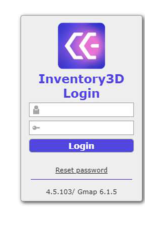
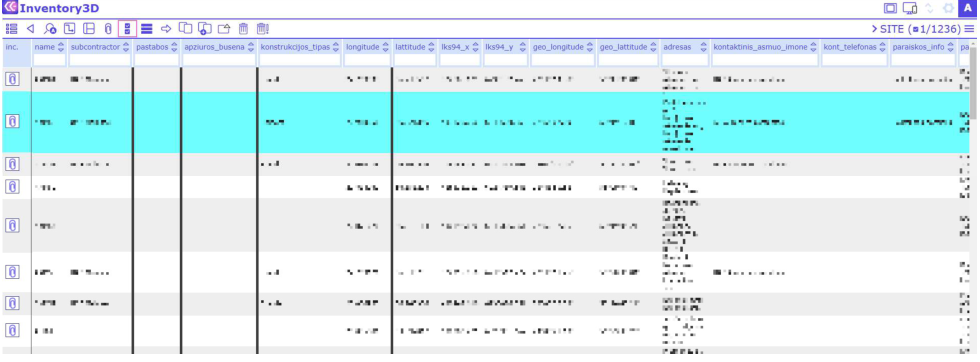
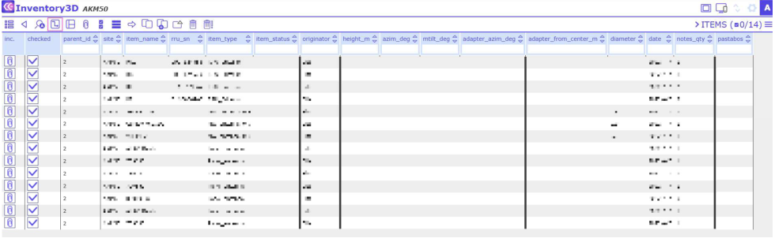
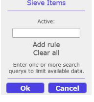

# CE Inventory3D User Guide

## Introduction

CE Inventory3D is a versatile tool for inventory planning, design, space and assets management. It consists of several building blocks that together provide a customized and tailored solution for a specific need.

Take inventory management: Error-prone databases which contain faulty inventory lists can be deleterious, especially in large industry environments. Thus, it is essential that upon inventory changing databases are regularly updated.

In this User Guide we introduce the CE Inventory3D. From a desktop, laptop or tablet computer with internet access, the Webapp connects to a database located on a server and enables the user to edit database records, sites and objects, to draw diagrams and to locate the assets on an integrated map. CE Inventory3D integrates data derived from various sources, such as sensors, Google Sheets, maps, and changes in database entries are synchronized with the server database content, keeping the database constantly up to date.

This User Guide explains the individual CE Inventory3D functions step by step and in detail.

## Quickstart guide

To access the CE Inventory3D web application, type its URL in the address field of a web browser. You can use any web browser, however, we recommend the up-to-date Google Chrome web browser.

The URL depends on the installation and initial configuration:

1. Web address, as an example: `https://<yourdomain>/ce_inv3d`
2. An address can be configured by the administrator.

Please note that for security reasons the application uses only HTTPS.

**Login with User and password combination**

**Select one or more database records**

Click on a record using the left mouse button. Selected records are blue:

**Open dataset**

Select a site, click on the Record's Details Tool  and the list of objects opens:

**Sieve**

Show only selected data of the currently opened table. Click 
 and enter a filter term:

**Data Editing & Synchronizing**

Select a respective entry while holding the CTRL key on the keyboard or right mouse click and edit the information. After editing changes will be saved automatically.
