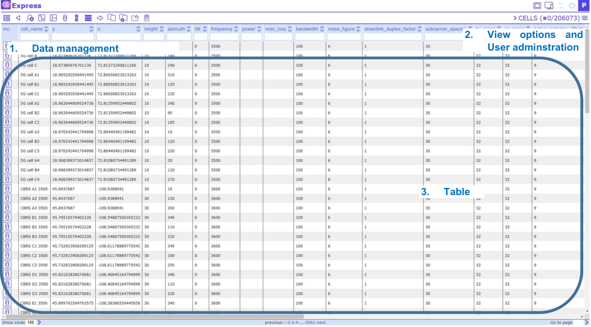
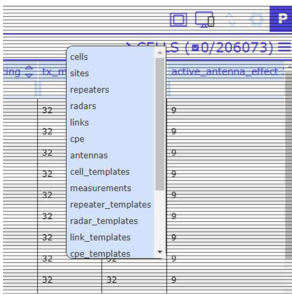
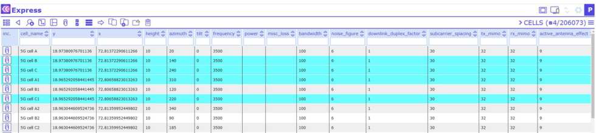
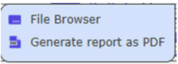
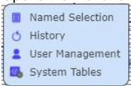

# Data Management

The Network Data Management view is divided into four sections:

- Tools for data management.
- User administration tasks.
- Table for data editing.
- View options.

To navigate through the tables, click on the table name at the top right corner.

To select a record, click on a record with the left mouse button. Selected records are colored in blue:

## Data management tools

The Data management tools are found at the top of the screen:

### Table view

Load data from the previously configured server location and open the Table view. Here, several functions can be performed, eg sorting or filtering data.

### Back

Go one step back and show previous data.

### Search (sieve)

Sieve the data in the currently opened table for one or more filter terms.

### Multiple table view

View and edit all tables from one site simultaneously in one window.

### View attachments

View the list of attachments associated with a given record. To do so, select a record of choice, then click on the View attachments button and a dialog will open with the respective attachments listed. To view an attachment in a separate browser tab simply click on the attachment of choice.

### Synchronize changes

The button Syncronize changes was removed in version 4. All the changes are commited automatically after user leave the edited field.

### Select/unselect all

Select/unselect all currently shown database records.

### Show selected/Show all

Shows all currently selected database records or all the records.

### Move record

Move an object from one site to another. To do so, select an object and click on the Move Record button. Then select the site you want to move the object to and click the move button again. Note that attachments are not moved.

### Copy record

Duplicate a database record from the Table view. Select the record to be duplicated. Then click the Copy Record button and the duplicated record appears in pink color in the Table view as a new record. Note that if the selected record to be duplicated has child objects, Copy Record will duplicate the entire record incl. child objects. Attachments are not duplicated.

### Add new record

Add a new record to the Table view. Note that the newly added record will appear in orange writing.

### CE API

Call CE API tool. Note: The administrator has to configure the tool.

### Export selected

Export selected items.

###  Delete record

Remove a selected record from the current view. Note that removed records will be hidden from the user. Only administrators can delete a removed record from the database permanently (or restore it).

###  Remove selected

Removes selected objects.

## View options and User administration

### Map overlay

Opens map view.

Opens table view.

### Additional tools

Opens the menu:

###  Settings

Opens the menu for administrator functions:

### User name/ Help/ Logout

Help - Displays the User Guide for quick help.

Logout – Logoff the user from CE Inventory3D.

## Table

The table comprises all network data. The data can be managed with the Data Management tools (see above).
