# Database organization

## Page setup and navigation

### Organization of single and multiple tables

The number of records displayed per page can be set on the bottom left corner. Furthermore, you may scroll through the pages using the commands in the bottom middle and bottom right corner. The table name (here: cells), the total quantity of entries (here: 20607), and the quantity of currently selected entries (here: 0) are shown on the top right corner.

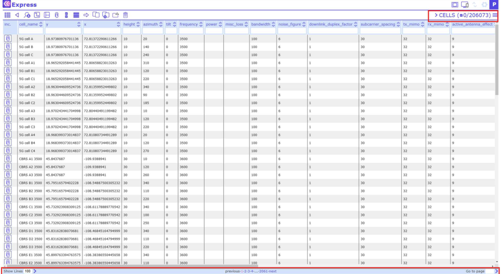

Note that the number of filtered records will be shown, if the user applies a filter:

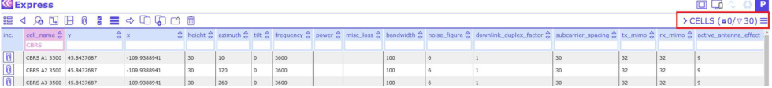

### Organization of columns

The column order can be adjusted by clicking on  in the top right corner.

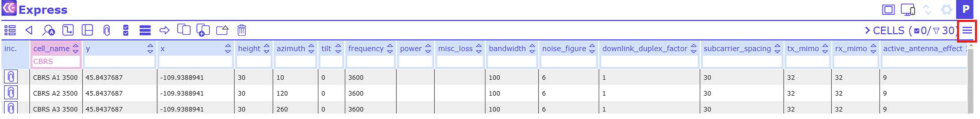

A menu opens in which the position of the columns can be sorted by clicking the arrow symbols. Individual columns are switched visible/invisible by clicking on the eye symbols.

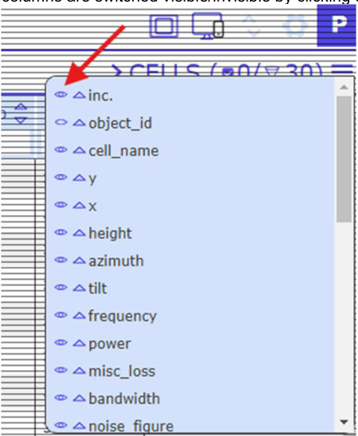

The columns can be sorted alphabetically from A>Z or from Z>A using the up and down arrow symbols within the column headers:

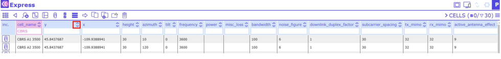

### Navigation across tables

There are 2 ways to change from one table to another. Either click on the table name in the top right (here: cells) and a menu opens with all available tables.

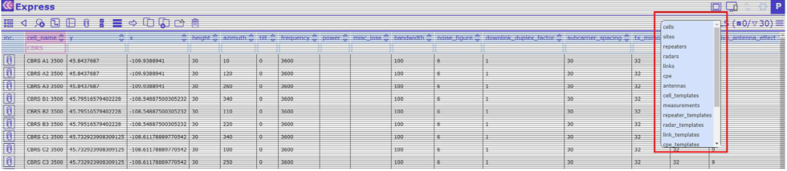

## Filtering, sorting, editing, and linking database records

The database entries can be sorted according to their individual values. To do so, click on the column header and a dropdown menu opens with the following functions: "Set selected", "Add link", "Clear this filter", "Clear all filters", "Set defaults" and "Set as default sort field":

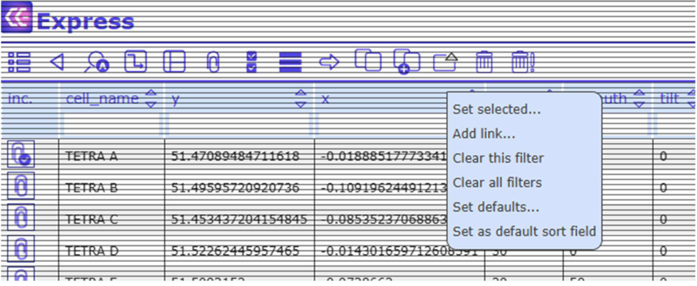

Alternatively, and more convenient for simple searches, columns can be filtered using the "quick filter" fields below the column names:

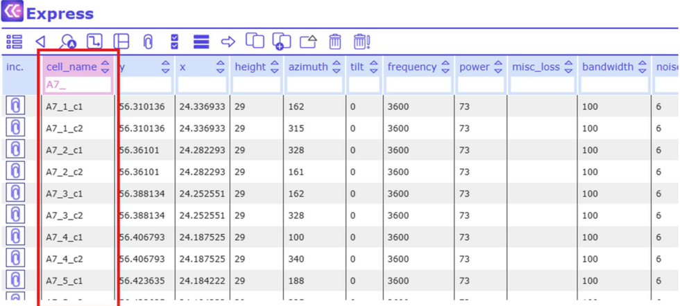

Users can use star symbol "\*" as wildcard. Possible filtering options:

- `*` - any non-null value
- `!*` - null value
- `[text]` - anything that contains the [text] value at the beginning. The same as `[text]*`
- `[text]*`
- `*[text]`
- `[text]*[text]`
- `![text]` - anything but the defined [text] value
- `"[text]"` - for exact match of value

Filtering options for numeric values:

- `=n` - exact match of n
- `<>n` - anything else but n
- `<n` - less than n
- `>n` - greater than n
- `<=n` - less than or equal to n
- `>=n` - greater than or equal to n

The Filter function can be used on several columns simultaneously. The headers of columns with active Filter function are marked in pink color:

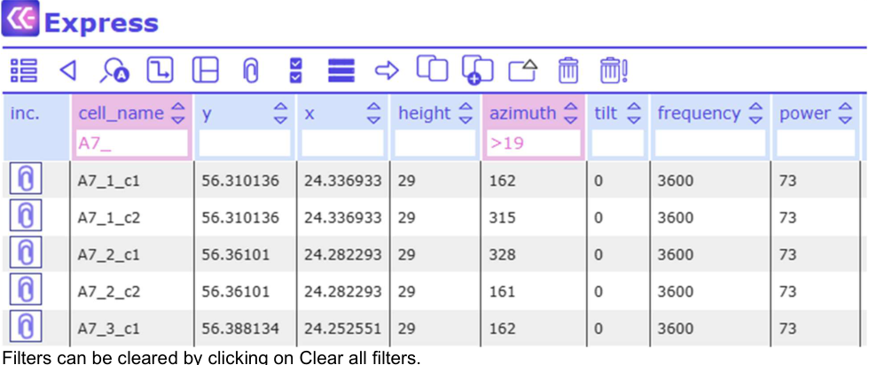

Filters can be cleared by clicking on Clear all filters.

### Set selected

This feature allows bulk editing of several records at once: Select the respective records, click on the column header and choose "Set selected" from the dropdown menu. A dialog opens with a text field. Fill in the term you want the selected database records to be changed to. Then click on "Change".

1. Select the records

   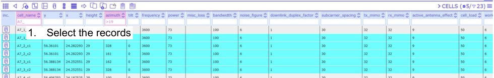

2. Click on the required column header (here: tilt) and choose Set selected

   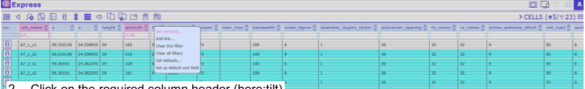

3. Define the new value and click Change

   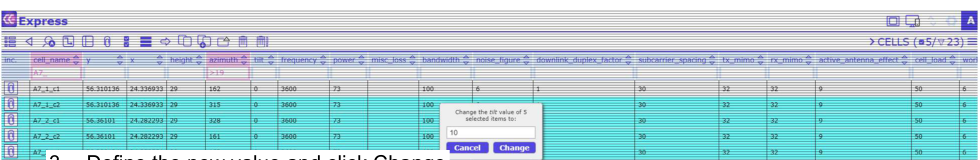

### Add link

Each database record may comprise reference links to other database records. This means that a link can be added to reach another database record.

Select the respective record, click on the column header and choose "Add link" from the dropdown menu. In the pop up window, click on Add new reference. A list of component types opens. Select the one you want to link to. Choose the component and confirm the selection. A new link has been created.

1. Select the record

   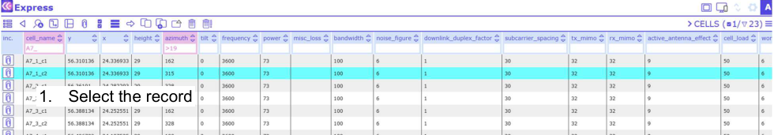

2. Click on the required column header (here: miscloss) and choose Add link

   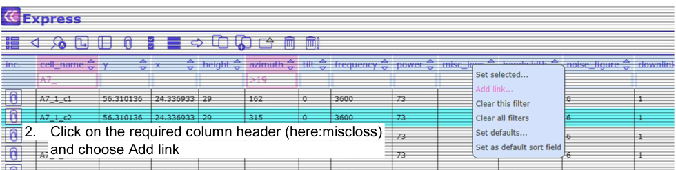

3. Click on Add new reference ...

   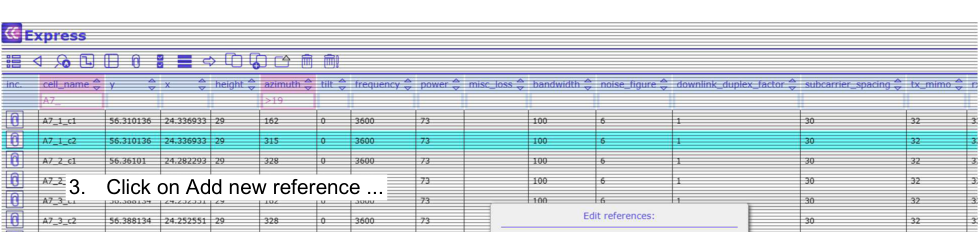

4. Select the type of component you want to link to (here: calculation tasks)

   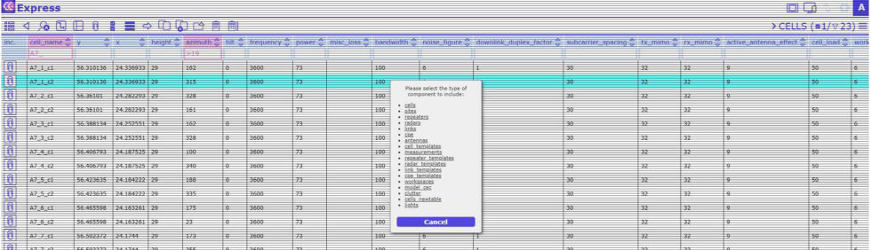

5. Choose the repeater(s) you want to link to and confirm the selection with  in the top left corner

   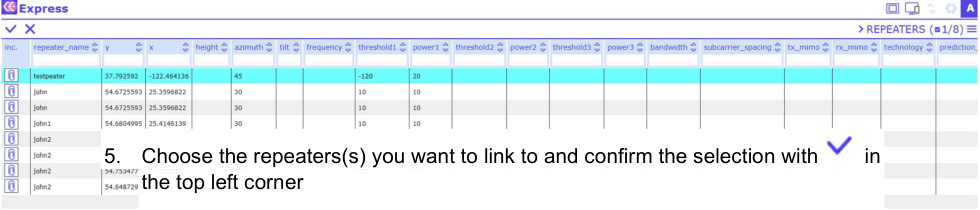

6. The link has been created

   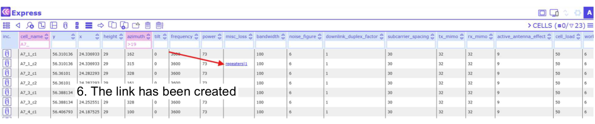

## Adding, viewing, downloading and deleting attachments

Each database entry can be connected with any type of attachment, for example, a picture or a text file. Entries with connected attachments have a blue check symbol next to the paper clip symbol in the column "Inc.", while entries without attachment have only the paper clip.

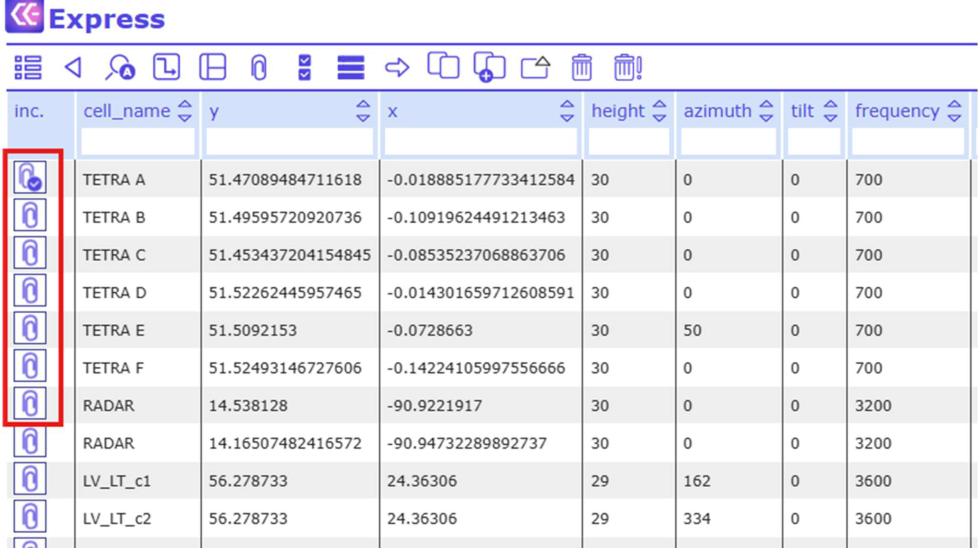

**Adding attachments**

To connect a database entry with an attachment, click on the paper clip symbol in the column "Inc.". A dialog opens that allows you to browse your computer for the attachment of your choice or to take a photo.

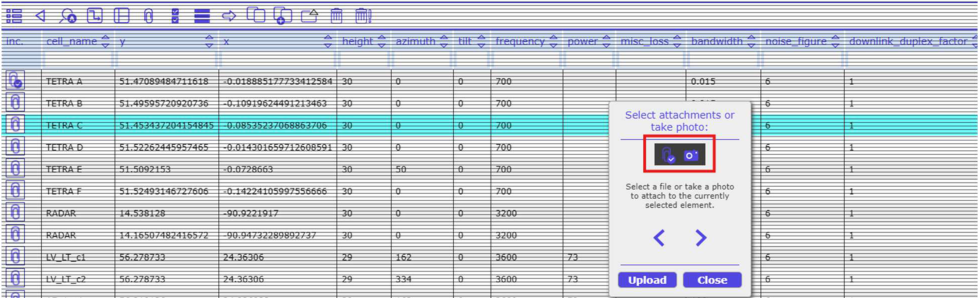

**Viewing, downloading and deleting attachments:**

To view the list of attachments connected to an entry, select the respective entry and click on  in the toolbar:

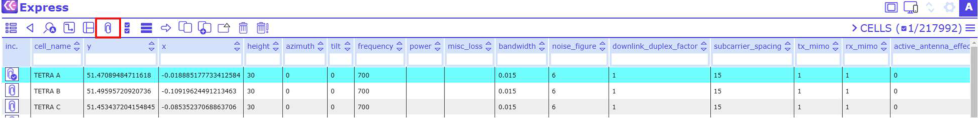

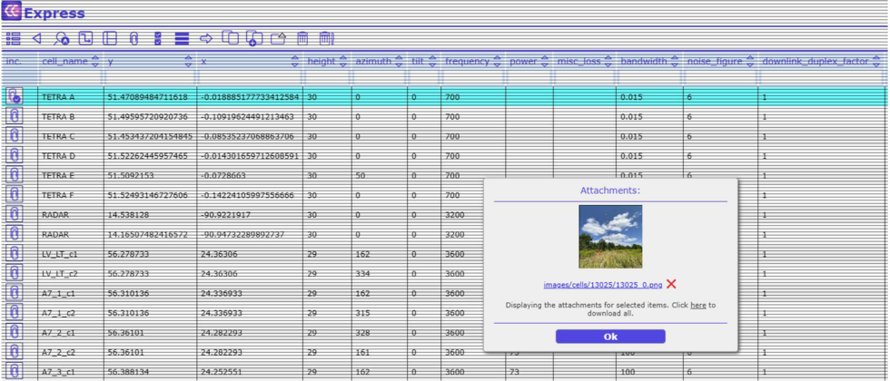

In the attachments the listed images are shown as thumbs. Select an attachment from the list and it opens in a separate browser tab.

Another way to view an attachment list is to move the pointer over the check symbol in the column "Inc." and to click the right mouse button.

The selected attachments can also be downloaded.

To delete an attachment, click on the red cross symbol.

## Search (sieve)

It is possible to display only selected data from an open table. Click on the button  in the toolbar.

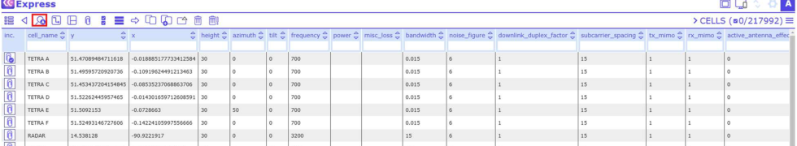

And a dialog will open:

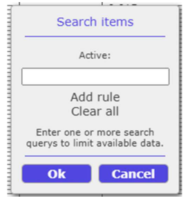

Note that by clicking "Add rule" you may search (sieve) with two or more filter terms that are connected via the operation "OR", not "AND". Thus, the result of two filters will show all items that comprise either the first or the second search term in their attributes.

For example, do you want to search the table cells for records starting with defined characters? Then the Search tool will help.

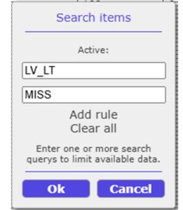

Click Add rule in order to add another search term, or click Clear all to remove all active searches.

To start the sieve process, click OK.

**Results**

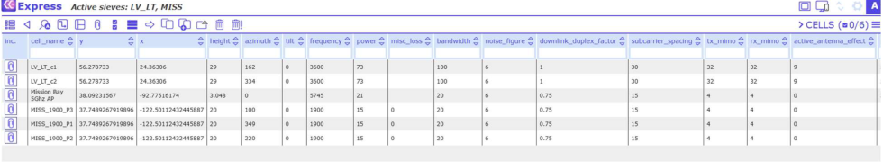

## CE API

It is possible to call other tools configured by the administrator. For every table a different tool can be configured. To start tool selection, click on the button  in the toolbar.

## Import CSV

This tool is integrated into the "CE API" tool. It is possible to import data from .csv files. Note(!): Consult with the administrator before import.

"Import CSV" opens a new window:

1. 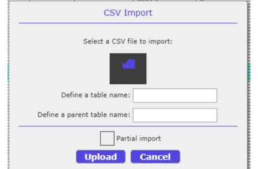

Data can be imported either as a new table (level 0), or added as a child table to a parent table (level 1). When adding a new table, it is required to define the table name. When adding a child table to a parent table, it is required to enter the parent table name.

Requirements:

1. The data in the CSV file should be separated by the symbol ";"
2. Avoid space and special characters in the table name
3. Level 0 table – CSV file must comprise a column object_id
4. Level 1 table – CSV file must comprise a column object_id and a column parent_id, with the parent_id value equal to the object_id of the parent table

When adding a child table to a parent table, choose the parent table from the dropdown menu:

2. 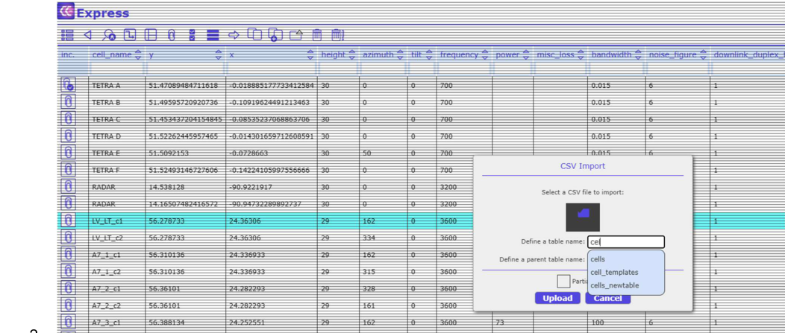

**Partial Import**

The Partial Import feature allows to add records to an already existing table. If the box "Partial import" is checked, the new records will be added to the defined table:

3. 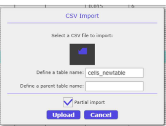
