# Exploring data

## Export selected

Data subsets can be exported as .xls or .csv files. Select the database records of choice, then click Export Selected  button:

A pop up window opens.

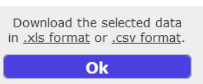

Click on the links to choose between .xls or .csv file formats.

Note that hidden columns are not exported.

## PDF report

A PDF report summarizes information associated with one or more objects. For generating a report, first select the objects of choice. Then open the Import Export menu with  and choose "Generate report as PDF":

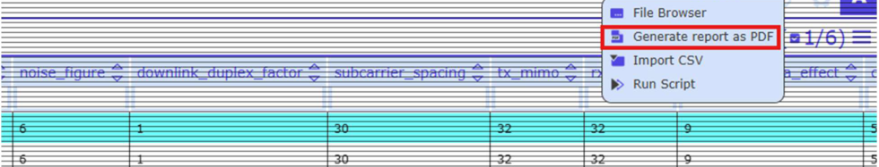

A new dialog appears. Open the PDF report by clicking to the file name:

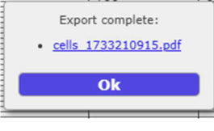

Note that the administrator has to prepare the template for the PDF report. Please inform the administrator in case of problems with generating PDF reports.

## File browser

Open the Data Export menu with  and choose "File Browser":

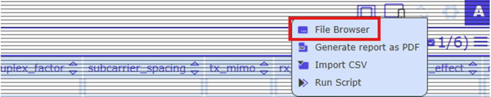

View attached files, download or delete files:

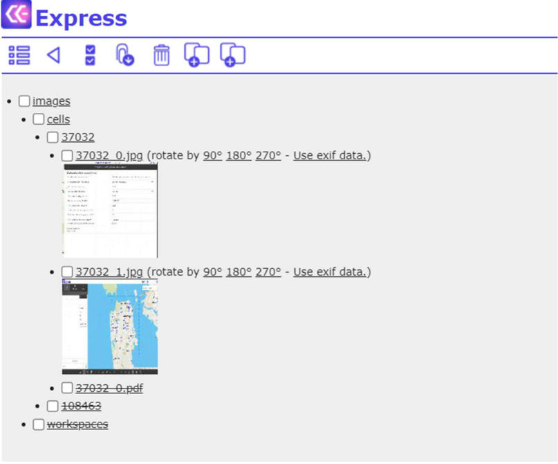

Images are shown as thumbs. Note that it is possible to rotate the images.

**File Browser Toolbar:**

 Open the Data View Panel

 Go one step back

 Select / unselect all files and folders

 Download selected files

 Delete selected files

 Restore selected files

When an image is deleted, said image is marked as strikethrough on the File Server:

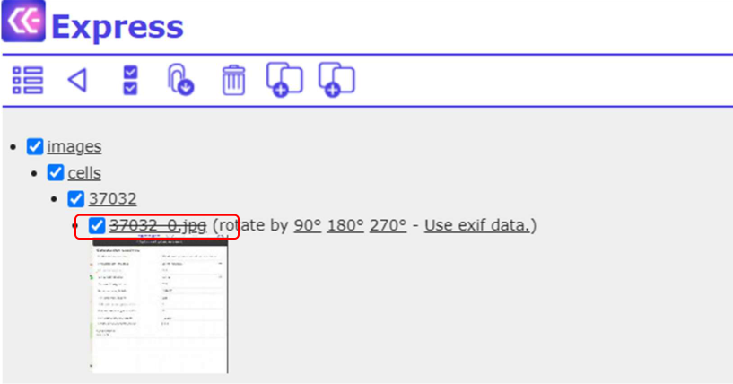

You can restore the image by selecting the strikethrough object and clicking :

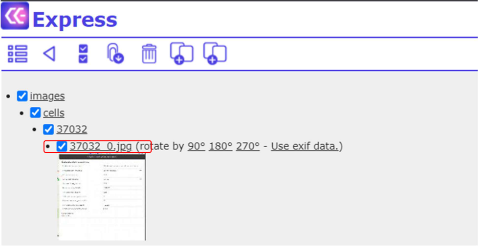

## Quick references

Quick references are defined by the administrator and allow users to open a reference object in a separate browser tab. If Quick references are enabled, the respective column is marked with "\*", for example "site":

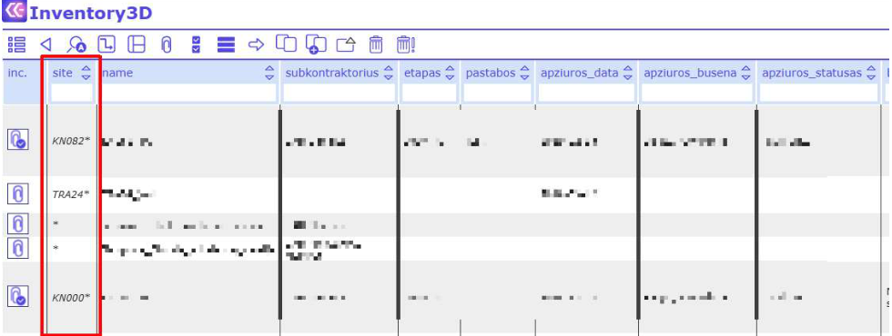

To open a reference link, select it in edit mode (right click on it) and click "here" in the opened dialog.

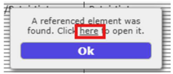

The referenced object is opened in a separate browser tab.

## Default editing and manual editing

If the administrator has defined default values (Administrator Guide: "Set Defaults"), editing column information may include selecting values from a drop-down menu. If the menu does not comprise the desired value, users may manually edit the information or clear the value:

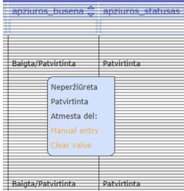

## External Links

It is possible to add links to external webpages to the webapp, for example:

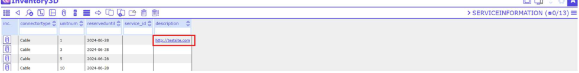

## Displaying Rasters

It is possible to display raster type of data, similar to graphical layers, on the map. Rasters are created by the administrator, but users may also access and configure the table map_rasters:

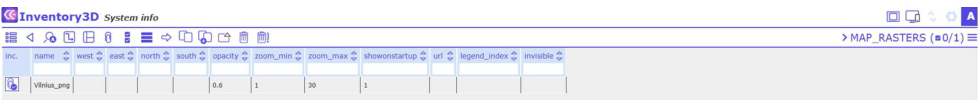

If the raster is a PNG or JPG file, users can edit the coordinates of the top-left and bottom-right corners of the picture in the columns West, East, North, and South, and define the opacity.

Example raster:

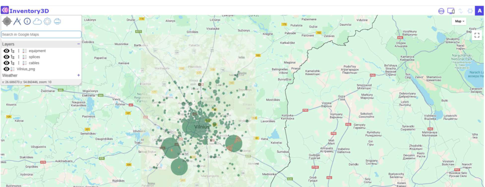

**Raster legend**

From the table map_rasters users may access and configure the child table map_rasters_legend, in which the raster legend is defined:

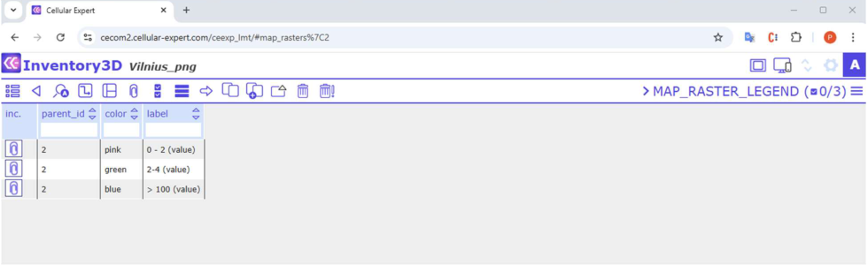

The legend color is defined in the field Color. The field must comprise the color code which is formatted as follows: `#RRGGBB`, where RR is red color value in hexadecimal format, GG is green color value in hexadecimal format, and BB is blue color value in hexadecimal format. For example, code `#00FF00` would mean green color. The color value can be acquired from the picture using any software with a color picking tool, e.g. Microsoft Paint or Free Color Picker.

The legend labels are defined in the field Label of the table "map_raster_legend".

Rasters and Raster legends are shown in the list Layers.

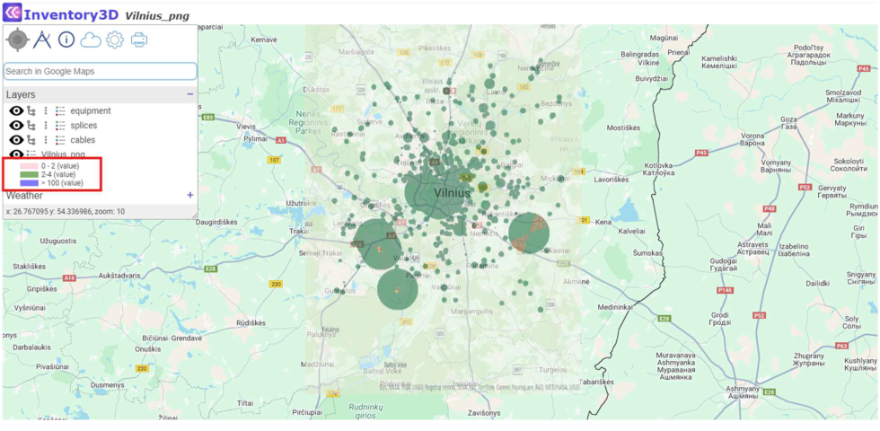
