# MAP functionality

Users can work with maps only after prior configuration by the administrator. Select a site and open the map:

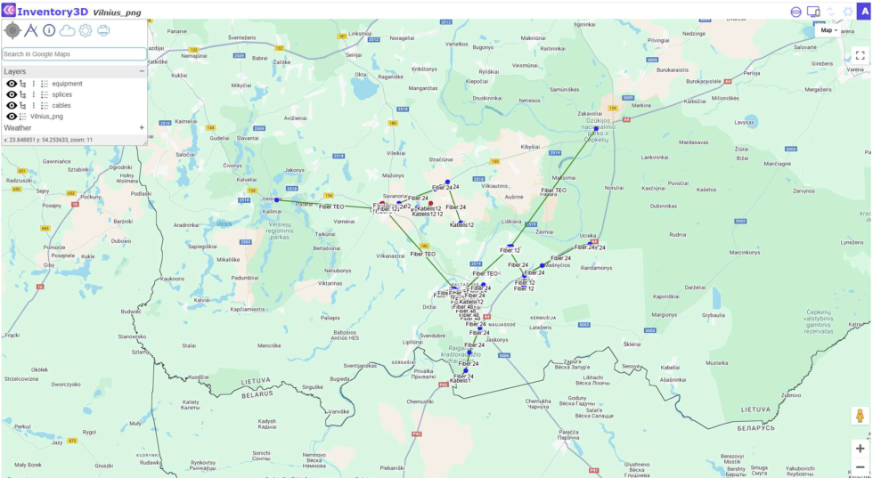

**Map viewing options**

On the right side of the screen, you find the commands

Full screen  - Google Street View 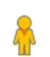 - Zoom in / out 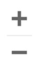

Map view - select the preferred map background, for example ESRI streets:

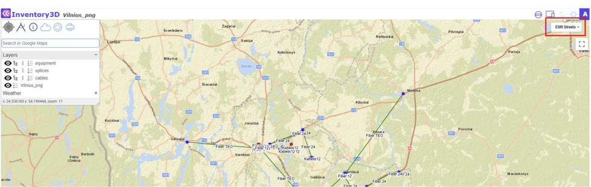

**Home**

 Moves the map view to your current location.

**Measure Distances**

Select the Measure Tool
, left-click on the starting point, then move the mouse over the map - distance and azimuth values will be displayed between the starting point and the mouse cursor.

**Link to database**

Map and database are functionally connected. Select the info tool . Then click on a site in the map (here: Abava), and a popup window opens:

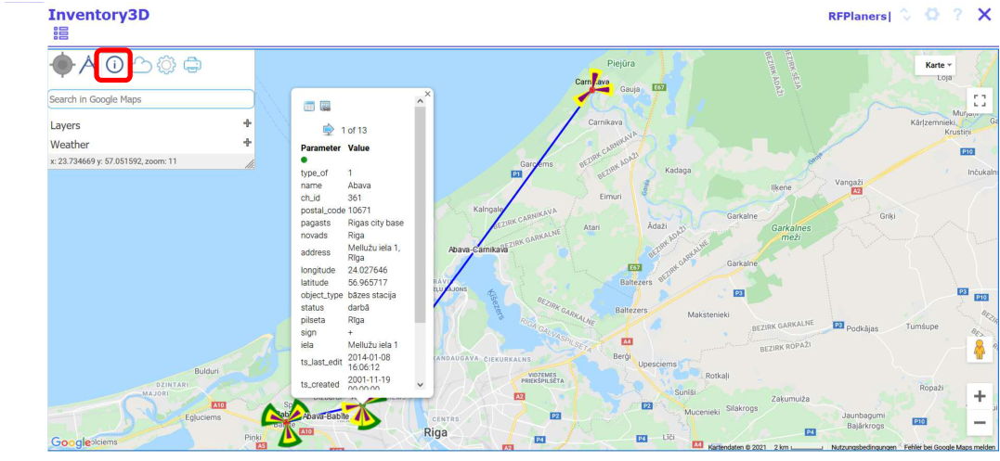

The popup window comprises links to the site (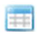) and to the attachments file browser (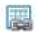)

Browse the parameters of the selected site by using the buttons
.

**Local Weather**

Display local weather conditions by clicking on  and then on a custom position on the map. A popup window opens with the local weather information. Users may choose from daily, weekly, and monthly data:

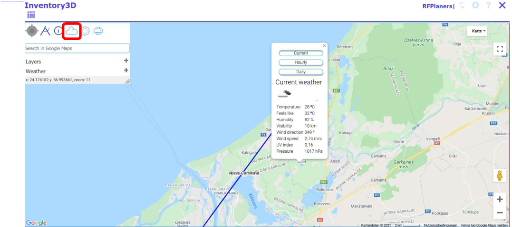

**Address search**

Use the field "Search in Google Maps" to search an address and zoom to the defined address.

**Print map**

Custom map views can be exported and printed. In the Map toolbar, click the print button 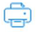 .

A popup window opens with the possibility to enter a document header. Then send the selected map view to the printer with 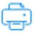 or :

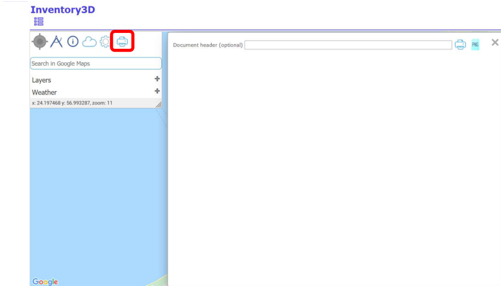

**Vectors, Rasters and Weather layers**

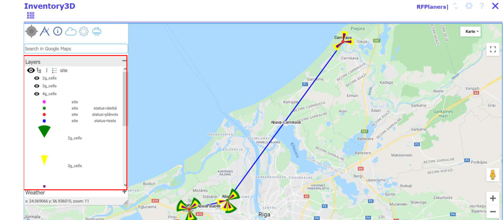

The map functionality allows to show or hide vectors (points, lines), rasters or weather layers.

Use the  and  to show or hide objects.

Further, it is possible to select the child objects shown on the map:

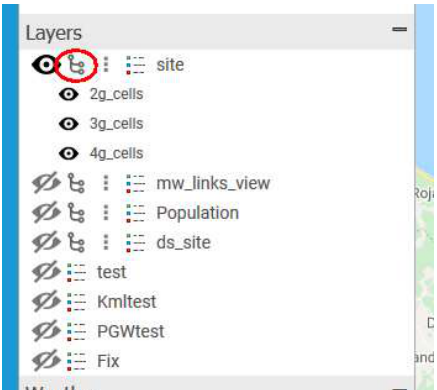

Additional map functions are shown after clicking the menu icon 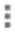 .

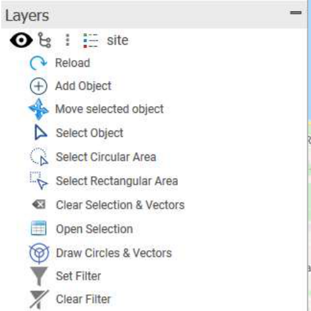

"Reload" allows to reload the layer. Edit an object and click "Reload" to show the map with the edited features.

"Add Object" allows to add an object to the map.

1. Select the layer on which You would like to add an object, for example "site". Then click "Add Object".
2. Click to the position on the map where you would like to add a new object. If the layer consists of lines, you need to click on the map two times for each end of the line.
3. An object will be created without a label (if label was not described in inv3d_map_settings).
4. Use the info tool  to open the Inventory3D page for the new object, edit the attributes and save the information to the database.
5. Click "Reload" and the map will be reloaded with the newly added attributes, for example a label.

"Move Object" allows to move an object of point type on the map

1. Select the layer on which You would like to move an object, for example "site". Then click "Select Object".
2. Select the object on the map (it should be marked with a square).
3. Move the pointer to the desired position on the map. Click and the selected object will be moved to the new position. The function will not work if two or more objects are selected.

"Set Filter" allows to filter the objects shown on the map.

For example, only sites with the address equal to Riga are shown:

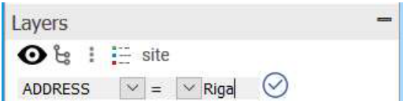

If the condition *like* is selected, as in the example below, only objects with the address containing Riga will be displayed.

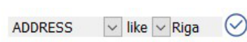

"Clear Filter" allows to clear a preset filter.

"Select Object" allows to select one object from the map.

To select an object, first click "Select Object" and then on the object on the map.

"Select Circular Area" and "Select Rectangular Area" allow to select multiple objects on the map.

1. Click "Select Circular Area" or "Select Rectangular Area".
2. Click the mouse button on the map and release.
3. Move the mouse to select several objects and click the mouse button again to release.
4. Selected objects are marked with a yellow square:

   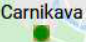

"Open Selection" Allows to open the CE Inventory3D attribute information of the selected objects. Click "Open Selection" and a new browser tab opens with the grouped data for the selected objects.

"Draw Circles & Vectors" Allows to draw circles with a defined radius and lines with a defined azimuth for selected objects. This feature must be configured by the administrator. It draws vectors based on data defined in the tables `[table]_circles` and `[table]_vectors`, where table is the name of layer table.

"Clear Selection & Vectors" Allows to clear all selections, drawn circles and vectors.

Just as the Vectors, Raster and Weather layers, for example the current weather, are shown or hidden the buttons  and  .
