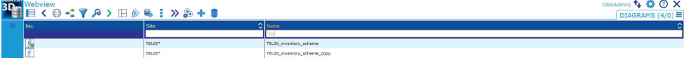
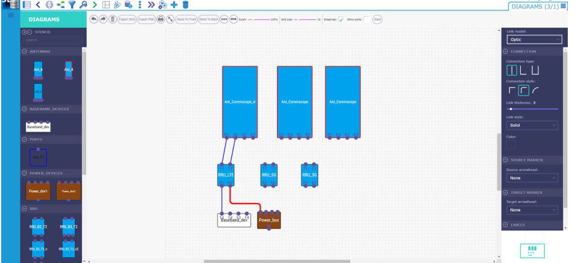
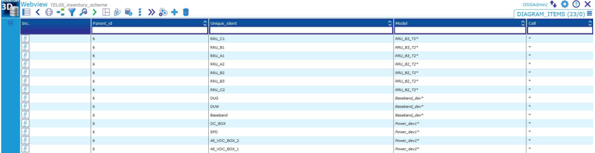
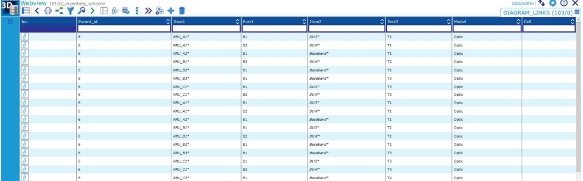
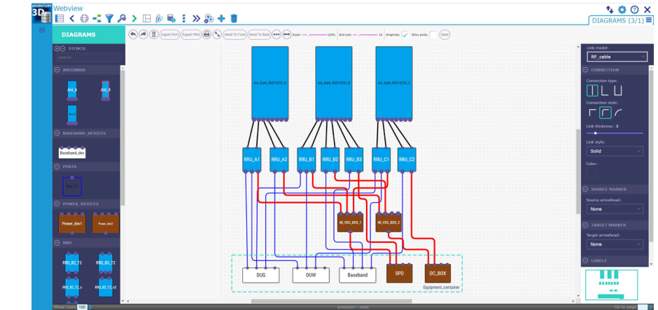
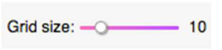
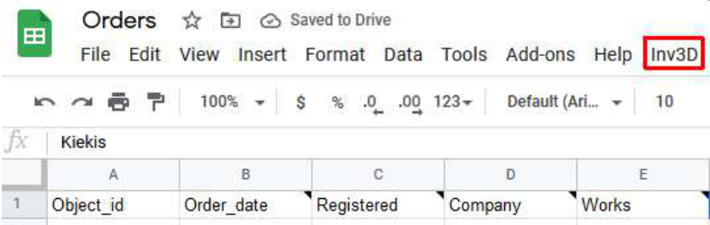
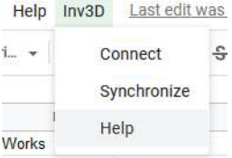
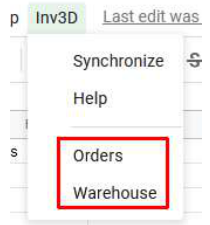

# Optional CE Inventory3D features

##  Diagram tool

Users can work with diagrams only after prior configuration by the administrator. Once configured the button  appears in the toolbar.

- Diagrams can be created and modified in two ways:
  - using the graphical diagrams interface, or
  - creating and editing records in the tables "Diagram_items" and "Diagram_links"

- To make a diagram, add a new record in the table "Diagrams":

  

then

- select the record, press the button  and create the diagram using the graphical drawing interface (method A)

or

- select the record, press the button  and create the diagram records in the tables "Diagram_items" and "Diagram_links" (method B)

**Method A**

Using the graphical drawing interface, the diagram can be created by dragging and dropping predefined models from the models templates toolbar and making connections between them. After synchronizing (see section 3.10) all information is saved in the diagrams data tables "Diagram_items" and "Diagram_links". For this reason, diagram modifications can also be performed by making changes directly in those tables.

Graphical drawing interface:

By drag and drop, select the item types from the left and the connection types from the right.

**Method B**

Using the table interface, the diagram can be created by adding records in the diagrams data tables "Diagram_items" and "Diagram_links".

The table "Diagram_items" contains the information about the displayed items. For example, in the mobile networks industry this could be antennas, RRUs, power devices etc.

The table "Diagram_items" has the two mandatory fields "Unique_ident" and "Model":

- "Unique_ident" – item's unique identification. "Unique_ident" has to be unique for the same diagram
- "Model" – the type of graphical element for the item visualization

The table "Diagram_links" comprises the information about the connections between the items. The table "Diagram_links" has the following fields:

- Item1 – the item a connection comes from. For example, RRU
- Port1 – a port of Item1
- Item2 – the item a connection goes to. For example, antenna
- Port2 – a port of Item2
- Model – type of a connection/cable. For example, RF_cable

Following successful table configuration, the diagram can be shown in the graphical editor interface. Simply go to the table "Diagrams", select the diagram record, and press the button . Example:

For follow up diagram modifications, both the graphical and the table interface can be used. The changes made by using the graphical editor will be displayed in the diagrams data tables and vice versa.

**Diagrams toolbar functions:**

 undo / redo action

 clear paper

 open as SVG / PNG in a pop-up window

 open print dialog

 toggle full-screen mode

 bring object to front / send object to back

 auto-layout graph

 zoom to fit

 zoom out / zoom in

 change grid size

 enable / disable snaplines

 show / hide port names

 save diagram

## Integration with Google Sheets

There is the possibility to integrate one or more tables from Google Sheets into the CE Inventory3D webapp. First, the Google Sheet should be prepared with CE Inventory3D configuration and Google script. Then an extra button "Inv3D" will appear on the Google Sheets toolbar:

Clicking this button opens a dropdown menu with the commands "Connect" for connecting to the Inventory3D database on the server, "Sync" for synchronizing data from Google Sheets with CE Inventory3D, and "Help":

After connecting to the CE Inventory3D database, a list of tables appears (here: Orders and Warehouse). The list of tables depends on the configuration in Google sheets:

Any changes in the Google Sheets are synchronized with CE Inventory3D by clicking the command Synchronize from the dropdown menu.

Note: Google Sheets must have additional configuration to connect to the CE Inventory3D database and to choose which tables can be accessed. A prepared script should be there, too.
